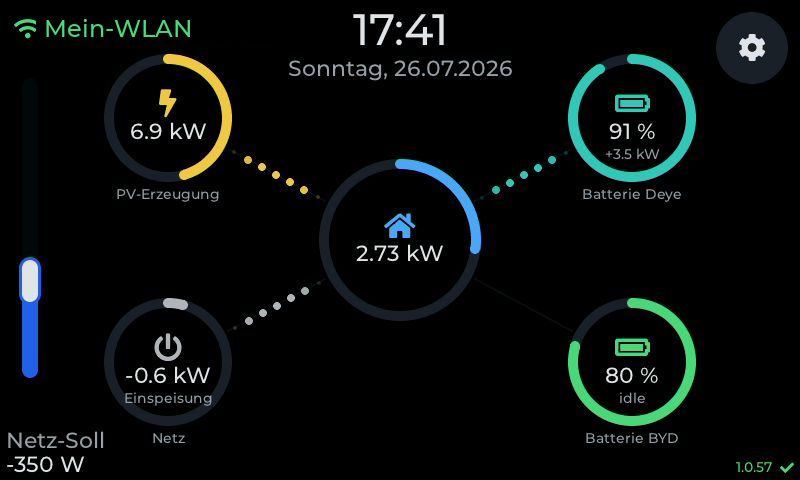
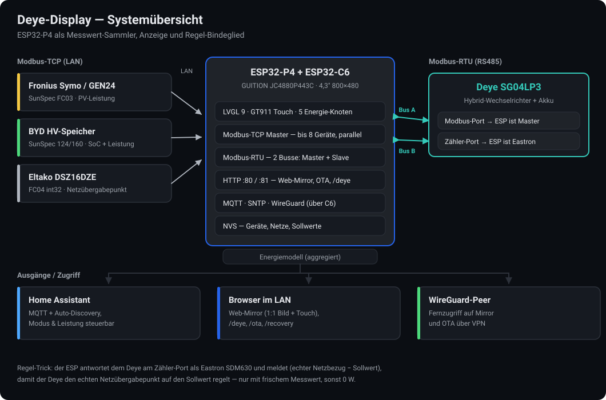
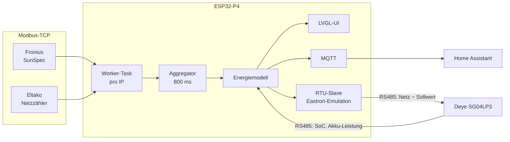
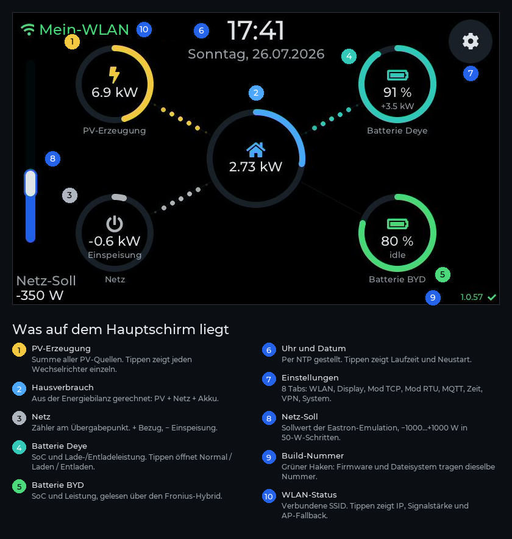
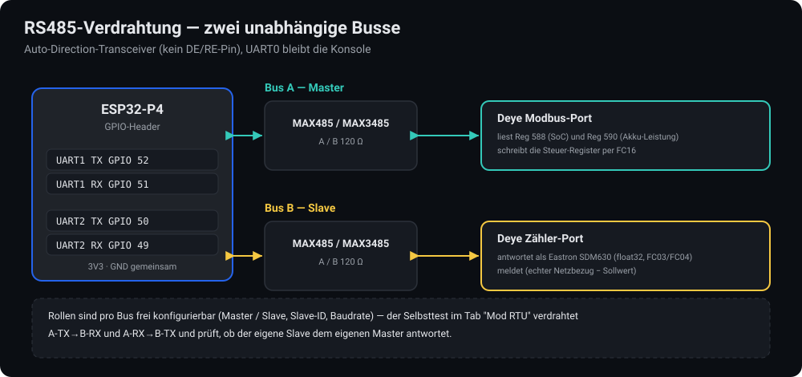

# Deye-Display

**Energie-Dashboard und Regel-Bindeglied für einen Deye-Hybrid-Wechselrichter — auf einem 4,3″-Touchdisplay mit ESP32-P4.**

Das Gerät sammelt die Messwerte einer real gemischten PV-Anlage (Fronius-Wechselrichter, Eltako-Netzzähler, BYD-Speicher, Deye-Hybrid), zeigt sie als animiertes Energieflussbild, schickt sie an Home Assistant — und greift auf Wunsch selbst in die Regelung ein: es antwortet dem Deye am Zähler-Port als Eastron SDM630 und verschiebt damit den Arbeitspunkt am Netzübergabepunkt.



> Echter Screenshot des laufenden Geräts, geholt über den eingebauten Web-Mirror. Nur der WLAN-Name ist ersetzt.

---

<details>
<summary><b>English summary</b> (click to expand)</summary>

Firmware for a **GUITION JC4880P443C** (ESP32-P4 + ESP32-C6, 4.3″ 480×800 MIPI-DSI IPS, GT911 touch) that turns the panel into an energy dashboard and control bridge for a **Deye SG04LP3** hybrid inverter.

* **Reads** up to 8 Modbus-TCP devices in parallel (Fronius/SunSpec, Deye native, Eltako DSZ15/16), plus two RS485 Modbus-RTU buses.
* **Bridges** Modbus-TCP to RTU in the other direction: a server on port 502 forwards LAN requests onto the RS485 buses, so any Modbus master can read and write the Deye's registers without its own adapter. Multiple concurrent clients, both buses routable by unit id.
* **Emulates** an Eastron SDM630 energy meter on the Deye's meter port and reports *(real grid power − setpoint)*, so the inverter regulates the real grid connection point to a setpoint you pick on screen. Emulation is gated on a **fresh** meter reading — a frozen value once caused a 15 kW export runaway.
* **Controls** the Deye battery: Normal / forced charge / forced discharge, from the touch UI or from Home Assistant, with an SLS (main-fuse) export guard that throttles discharge power.
* **Publishes** all values over MQTT with Home Assistant auto-discovery (7 sensors + a mode select + a power slider).
* **Mirrors itself** into a browser: the ESP32-P4 hardware JPEG encoder streams the actual framebuffer as MJPEG (~8 fps) and injects mouse/keyboard back into LVGL — the web page *is* the display.
* **Flashes itself** over WiFi: `POST /ota` (firmware) and `POST /ota/fs` (filesystem), dual 4 MB slots, plus a `/recovery` page with rollback.
* Pure **ESP-IDF 5.x** + **LVGL 9**, built with PlatformIO. WiFi runs on the on-module ESP32-C6 via ESP-Hosted. Also on board: SNTP clock, WireGuard VPN client, captive-portal WiFi provisioning, and a Modbus register probe/CSV backup tool at `/deye`.

Documentation is in German — see the [Wiki](../../wiki) for the full reference.

</details>

---

## Inhalt

* [Was das Gerät macht](#was-das-gerät-macht)
* [Hardware](#hardware)
* [Systemübersicht](#systemübersicht)
* [Der Hauptbildschirm](#der-hauptbildschirm)
* [Regelung: Eastron-Emulation und Deye-Steuerung](#regelung-eastron-emulation-und-deye-steuerung)
* [RS485-Verdrahtung](#rs485-verdrahtung)
* [Bauen und flashen](#bauen-und-flashen)
* [Web-Oberflächen](#web-oberflächen)
* [MQTT und Home Assistant](#mqtt-und-home-assistant)
* [Einstellungen auf dem Gerät](#einstellungen-auf-dem-gerät)
* [Projektstruktur](#projektstruktur)
* [Sicherheitshinweis](#sicherheitshinweis)
* [Dank](#dank)

---

## Was das Gerät macht

| | |
| --- | --- |
| **Messwerte einsammeln** | Bis zu 8 Modbus-TCP-Geräte, jedes mit eigener Worker-Task und eigenem Socket — ein langsamer Wechselrichter-Datalogger bremst den zeitkritischen Netzzähler nicht aus. Dazu zwei RS485-Busse für Modbus-RTU. |
| **Energiemodell bilden** | Aus PV, Netz und Akku wird der Hausverbrauch gerechnet. Jeder Wert läuft durch eine Plausibilitätsprüfung; fehlende Quellen zeigen `--` statt eines eingefrorenen Werts. |
| **Anzeigen** | Fünf Kreis-Gauges mit animierten Flusslinien, Uhr, WLAN-Status, Build-Nummer. Antippen öffnet Detail-Popups (Einzel-Wechselrichter, Akku-Modus, Laufzeit/Neustart). |
| **Regeln** | Eastron-SDM630-Emulation am Zähler-Port des Deye plus direkte Register-Schreibzugriffe für Zwangsladen/-entladen. |
| **Weitergeben** | MQTT mit Home-Assistant-Auto-Discovery, inklusive steuerbarer Entities. Dazu die Modbus-Brücke: Port 502 reicht Anfragen aus dem LAN auf die RS485-Busse durch. |
| **Fernwarten** | Web-Mirror (1:1-Bild plus Touch im Browser), OTA-Update über WiFi, Recovery-Seite, WireGuard-Tunnel. |

Unterstützte Geräteprofile am Modbus-TCP:

| Hersteller | Protokoll | Rollen |
| --- | --- | --- |
| **Fronius** (Symo, GEN24) | SunSpec, FC03 — Modelle 101–103/111–113 (AC), 124 (Speicher-SoC), 160 (MPPT), 201–204 (Zähler) | Wechselrichter, Zähler |
| **Deye** (SG04LP3) | natives Register-Layout, FC03 | Wechselrichter |
| **Eltako** (DSZ15DZ, DSZ16DZ(E)) | FC04, int32 Watt | Netzzähler, Erzeugungszähler |

Rollen bestimmen, welchen Knoten ein Gerät füttert: `Netz-Zähler`, `Erzeugungszähler`, `Wechselrichter`, `Batterie`, `Deye-Zähler`.

---

## Hardware

**[GUITION JC4880P443C_I_W](https://www.guition.com/esp32p4-display-module/esp32p4-display)** — ein fertiges Display-Modul, keine Bastelplatine:

| | |
| --- | --- |
| SoC | ESP32-P4 (Dual-Core RISC-V, bis 360 MHz) |
| Funk | ESP32-C6 auf dem Modul, angebunden über SDIO — WiFi 6 und BLE laufen dort (ESP-Hosted) |
| Panel | 4,3″ IPS, 480 × 800, MIPI-DSI (2 Lanes, 500 Mbps), Treiber ST7701 |
| Touch | GT911 kapazitiv, I²C `0x5D` |
| Speicher | 32 MB PSRAM, 16 MB Flash |
| Zusätzlich | microSD-Slot, GPIO-Header (hier: 2 × RS485) |

Das Panel ist im Hochformat verbaut (480 × 800) und wird per Hardware-PPA um 90° gedreht, damit die UI im Querformat 800 × 480 läuft. Pinbelegung und DSI-Timings stehen in [main/board_jc4880p443c.h](main/board_jc4880p443c.h).

Zusätzlich benötigt: **zwei RS485-Transceiver mit Auto-Direction** (z. B. MAX485-Module ohne DE/RE-Pin) am GPIO-Header.

---

## Systemübersicht



Der Datenfluss in Kurzform:



Prioritäten sind bewusst gesetzt: die RTU-Tasks (Regelpfad) laufen auf Priorität 5, die LVGL-/Touch-Task auf 4, der Netzzähler-Worker auf 3, PV-Worker auf 2. So wird die Bedienung nie zäh, weil ein Datalogger hängt — und der Regelpfad nie langsam, weil die UI zeichnet.

---

## Der Hauptbildschirm



Der Hausverbrauch wird nicht gemessen, sondern gerechnet: `Haus = PV + Akku + Netz` (Vorzeichen: `+` = in den Verteiler hinein). Fällt eine Quelle aus, wird der betroffene Knoten auf `--` zurückgesetzt statt den letzten Wert weiterzuzeigen.

---

## Regelung: Eastron-Emulation und Deye-Steuerung

### Der Zähler-Trick

Der Deye regelt am eigenen Zähler-Port auf „null am Übergabepunkt". Hängt dort statt eines echten Zählers dieses Display, kann man den Nullpunkt verschieben:

```text
gemeldet an den Deye  =  echter Netzbezug  −  Sollwert
```

Bei Sollwert `−350 W` sieht der Deye also 350 W mehr Einspeisung, als tatsächlich fließt, und regelt seinen Arbeitspunkt so, dass real 350 W eingespeist werden. Der Schieber links am Hauptbildschirm stellt −1000 … +1000 W in 50-W-Schritten ein; der Wert liegt in NVS.

> [!WARNING]
> Die Emulation ist an einen **frischen** Messwert gekoppelt (`modbus_tcp_grid_w_fresh()`, max. 12 s alt). Ist der Wert alt, meldet die Emulation bewusst **0 W** statt des letzten Werts — sie antwortet weiter, damit der Deye keinen Zählerausfall meldet, gibt ihm aber nichts zu regeln. Ein eingefrorener Messwert in einem laufenden Regelkreis hat hier einmal eine **Einspeisung von 15 kW** ausgelöst. Wer an diesem Pfad etwas ändert, muss diese Kopplung erhalten.

### Akku-Modus schreiben

Über das Popup am Deye-Knoten (oder aus Home Assistant) sind drei Modi wählbar. Geschrieben wird per **FC16** über den RTU-Master-Bus, in einer eigenen Task — nicht auf der UI-Task, weil der Bus blockiert:

| Modus | Register |
| --- | --- |
| **Normal** | `142 = 2` (Zero Export to CT), `143 = 20000`, `126 = 5000`, `127 = 10`, `128 = 40`, `166–171 = 13` (SoC-Sollwerte), `172–177 = 0` (Netzladen aus) |
| **Laden** | `126 = Leistung`, `127 = 99`, `128 = Leistung / 50` (Ladestrom in A), `166–171 = 99`, `172–177 = 1` |
| **Entladen** | `142 = 3` (Selling First), `143 = Leistung` |

Leistungsbereich 1000 … 20000 W. Details und die Herleitung der Register: [Wiki → Deye-Steuerung](../../wiki/Deye-Steuerung).

### SLS-Schutz

Bei Zwangsentladung drosselt das Gerät Register 143 automatisch, sobald die Einspeisung 90 % des Nennstroms des Hauptschalters überschreitet:

```text
max. Export = SLS-Nennstrom × 3 × 230 V × 0,9
```

Bei 35 A also 21,7 kW. Der Nutzer-Sollwert bleibt dabei unverändert — sinkt die Einspeisung wieder, wird er wiederhergestellt. Einstellbar im Tab „System" (deaktiviert, 16/20/25/35/50/63 A).

---

## RS485-Verdrahtung



Beide Busse sind unabhängig als Master oder Slave konfigurierbar (Rolle, Slave-ID, Baudrate 4800–38400). UART0 bleibt die Konsole. Für den Selbsttest im Tab „Mod RTU" verbindet man A-TX→B-RX und A-RX→B-TX; der eigene Master fragt dann den eigenen Slave ab und misst die Laufzeit.

---

## Bauen und flashen

Voraussetzung: [PlatformIO](https://platformio.org/) mit der `pioarduino`-Plattform für ESP32 (wird aus `platformio.ini` geladen). Framework ist reines ESP-IDF, keine Arduino-Schicht.

### Über USB (Erstinstallation)

```bash
pio run -e guition-p4 -t upload -t flashfs -t monitor
```

Firmware **und** Dateisystem in einem Aufruf — das ist wichtig: ein Pre-Build-Hook zählt pro `pio run` genau einmal die Build-Nummer hoch und schreibt sie in `main/build_info.h` (Firmware/UI) *und* `data/build.txt` (SPIFFS-Image). Beim Booten vergleicht die Firmware beide Zahlen und meldet einen Versatz im Log und auf dem Bildschirm. Der grüne Haken unten rechts bedeutet: Firmware und Dateisystem passen zusammen.

### Über WiFi (danach)

```bash
IP=192.168.1.42
curl --data-binary @.pio/build/guition-p4/firmware.bin  http://$IP/ota
curl --data-binary @.pio/build/guition-p4/storage.bin   http://$IP/ota/fs
curl -X POST http://$IP/ota/reboot
curl -s http://$IP/ota           # build und fs_build müssen übereinstimmen
```

Es gibt zwei 4-MB-App-Slots; geflasht wird immer in den inaktiven. Während des Schreibens friert die UI ein und die Hintergrundbeleuchtung geht aus — sonst flackert das Panel sichtbar. Geht etwas schief, hilft `http://<ip>/recovery`: Firmware oder Dateisystem per Datei-Upload flashen, auf den vorigen Slot zurückrollen oder neu starten.

Mehr dazu: [Wiki → Bauen und Flashen](../../wiki/Bauen-und-Flashen) und [Wiki → OTA und Recovery](../../wiki/OTA-und-Recovery).

---

## Web-Oberflächen

Zwei HTTP-Server: `:80` für Seiten und Steuerung, `:81` nur für den MJPEG-Strom — so blockiert ein hängender Stream die Touch-Eingabe nicht.

| Endpunkt | Was es tut |
| --- | --- |
| `GET /` | **Web-Mirror**: das echte Panelbild als MJPEG (~8 fps, Hardware-JPEG-Encoder, Qualität 80) plus Maus- und Tastatureingabe zurück in LVGL. Inklusive Copy/Paste in Textfelder. |
| `GET /deye` | **Register-Werkzeug**: beliebige Holding-Register lesen (FC03), einzeln schreiben (FC16), Adressbereich als CSV exportieren und wieder importieren — praktisch, um Register zu finden oder eine Konfiguration zu sichern. |
| `GET /api/live` | Energiewerte, MQTT-/NTP-Status, Zeit als JSON |
| `GET /api/devices` | Pro-Gerät-Livewerte als JSON |
| `GET /ota` | laufende Version, Build, Slot, IDF-Version, MAC, Laufzeit |
| `POST /ota` · `POST /ota/fs` | Firmware- bzw. Dateisystem-Image schreiben |
| `POST /ota/reboot` · `POST /ota/rollback` | Neustart bzw. Slot-Rückrollung |
| `GET /recovery` | Notfallseite mit Upload-Feldern und Rollback |
| `GET /scan` · `POST /connect` | WLAN-Suche und -Verbindung (Captive Portal) |

> [!CAUTION]
> Keiner dieser Endpunkte ist authentifiziert. Das Gerät gehört in ein vertrauenswürdiges Netz — nicht ins offene Internet. Für Fernzugriff ist der eingebaute WireGuard-Client gedacht.

---

## MQTT und Home Assistant

Basistopic frei wählbar, Standard `deye-display`:

| Topic | Richtung | Inhalt |
| --- | --- | --- |
| `<base>/state` | → Broker | `pv_w`, `house_w`, `grid_w`, `byd_w`, `byd_soc`, `deye_w`, `deye_soc`, `deye_mode`, `deye_power` |
| `<base>/availability` | → Broker | `online` / `offline` (Last Will) |
| `<base>/deye/mode/set` | ← Broker | `Normal` \| `Laden` \| `Entladen` |
| `<base>/deye/power/set` | ← Broker | Leistung in W (1000–20000) |

Bei aktivierter Discovery legt das Gerät in Home Assistant selbst an: 7 Sensoren (Leistungen mit `device_class: power`, SoC mit `battery`), einen **Select** für den Akku-Modus und einen **Number**-Schieber für die Leistung — alle unter einem Gerät „Deye Display". Retain, Discovery und Last Will sind einzeln abschaltbar.

---

## Einstellungen auf dem Gerät

Über das Zahnrad, acht Tabs auf einer Leiste links:

| Tab | Inhalt |
| --- | --- |
| **WLAN** | Status, Netzsuche, bis zu 10 gespeicherte Netze mit Einzel-Löschen, Bildschirmtastatur mit Umlauten |
| **Display** | Helligkeit (LEDC-PWM), Kontrast (Software-Overlay), Standby (aus / 30 s / 1 / 2 / 5 / 10 min), Ausrichtung |
| **Mod TCP** | Geräteliste: Name, Hersteller, Rolle, IP, Port, Slave-ID, Poll-Intervall, Timeout — je Gerät einzeln |
| **Mod RTU** | Pro Bus: Rolle, Slave-ID, Baudrate; Selbsttest mit Laufzeitmessung |
| **MQTT** | Broker, Port, Zugangsdaten, Basistopic, Retain / Discovery / Last Will |
| **Zeit** | SNTP an/aus, Server, Zeitzone (13 Zonen mit POSIX-Regeln inkl. Sommerzeit) |
| **VPN** | WireGuard: Schlüssel, Tunnel-IP, Endpunkt, Keepalive |
| **System** | SLS-Nennstrom für den Export-Schutz, mit ausgerechnetem Maximum |

Konfiguration liegt komplett in NVS und übersteht Firmware-Updates. Die Tabs werden bewusst **nach** dem Laden aller Backends gebaut — andernfalls rendern sie leer und ein Speichern würde die gespeicherte Konfiguration überschreiben.

Beim ersten Start ohne bekanntes Netz öffnet das Gerät einen Access Point `DeyeDisplay-XXXXXX` (Standard-Passwort `deyedisplay`) mit **Captive Portal**: DNS-Hijack plus Redirect der Betriebssystem-Erreichbarkeitsprüfungen, sodass sich am Telefon direkt die Einrichtungsseite öffnet.

---

## Projektstruktur

```text
main/
  main.c                  Bootreihenfolge (Display → Touch → LVGL → UI → WiFi → Backends)
  display.c  touch.c      ST7701 über MIPI-DSI, GT911, Backlight-PWM
  lvgl_port.c  fonts.c    LVGL-9-Anbindung, 90°-Rotation per PPA, Tiny-TTF für Umlaute
  ui_flow.c               Hauptbildschirm: Gauges, Flusslinien, Popups, Uhr
  ui_settings.c           Einstellungsbildschirm mit acht Tabs und Bildschirmtastatur
  modbus_tcp.c            Multi-Geräte-Master, Worker pro IP, Aggregator, SLS-Schutz
  modbus_rtu.c            Zwei RS485-Busse: Master (Deye) und Eastron-SDM630-Emulation
  deye_ctrl.c             Akku-Modi, FC16-Schreibtask
  mqtt_fwd.c              Publish plus HA-Auto-Discovery
  wifi_mgr.c  captive.c   STA/AP-Verwaltung, Mehrfach-Netze, Captive Portal
  web_mirror.c            MJPEG-Spiegel plus Eingabe-Injektion
  ota.c  deye_web.c       OTA/Recovery, Register-Werkzeug
  ntp_client.c  wg_client.c   SNTP, WireGuard
  nvs_store.c             gesamte Persistenz
components/esp_wireguard  eingebundene WireGuard-Implementierung (BSD-3, trombik)
scripts/                  Build-Zähler und SPIFFS-Image-Erzeugung
register tables/          Register-Karten: Deye SG04LP3, Eltako DSZ15/16, SunSpec, Fronius
deye-register-map.csv     kommentierte Deye-Registerliste
docs/img/                 Bilder dieser Dokumentation
```

---

## Sicherheitshinweis

Dieses Projekt **schreibt in einen Wechselrichter**, der an einer Netzanlage mit Batteriespeicher hängt, und greift in dessen Regelung ein. Fehlerhafte Register, ein hängender Messwert oder eine falsche Grenze können zu unerwünschter Einspeisung, unerwünschtem Netzbezug oder Belastung des Hausanschlusses führen.

* Arbeiten an Netzanschluss, Zähler und RS485-Verkabelung gehören in fachkundige Hände; die einschlägigen Vorschriften und die Vorgaben des Netzbetreibers gelten unverändert.
* Die Registerbelegungen sind an einem konkreten Deye SG04LP3 ermittelt und können sich mit Firmware-Version oder Modell unterscheiden. Vor dem Schreiben prüfen — dafür ist das Werkzeug unter `/deye` da.
* Der SLS-Schutz ist eine Software-Hilfe, kein Ersatz für die Schutzeinrichtungen der Anlage.
* Es gibt keine Zugriffskontrolle auf den Web-Endpunkten. Betrieb nur im vertrauenswürdigen Netz.

Nutzung auf eigenes Risiko und eigene Verantwortung.

---

## Dank

* **Espressif** — ESP-IDF, `esp_lcd_st7701`, `esp_lcd_touch_gt911`, `esp_lvgl_port`, `esp_hosted` / `esp_wifi_remote`
* **LVGL** — Version 9
* **[trombik/esp_wireguard](https://github.com/trombik/esp_wireguard)** — WireGuard für ESP-IDF (BSD-3), aufbauend auf `smartalock/wireguard-lwip`
* **Pinbelegung und DSI-Timings des JC4880P443C** — ESPHome PR #12068 und `agillis/esphome-modular-lvgl-buttons`
* **Montserrat** — Schrift (SIL Open Font License)

---

## Ausführliche Dokumentation

Dieses README ist die Kurzfassung für Leute, die mit Mikrocontrollern und PV-Anlagen schon vertraut sind. Das **[Wiki](../../wiki)** erklärt dasselbe von Grund auf — ohne Vorwissen, mit einem [Glossar](../../wiki/Glossar) für jeden Fachbegriff:

| | |
| --- | --- |
| **Nachbauen** | [Hardware](../../wiki/Hardware) · [Bauen und Flashen](../../wiki/Bauen-und-Flashen) · [WLAN und Ersteinrichtung](../../wiki/WLAN-und-Captive-Portal) · [Die Menüs](../../wiki/Einstellungen) |
| **Verstehen** | [Modbus-TCP](../../wiki/Modbus-TCP) · [Modbus-RTU](../../wiki/Modbus-RTU) · [Modbus-Brücke](../../wiki/Modbus-Bridge) · [Architektur](../../wiki/Architektur) |
| **Benutzen** | [Deye-Steuerung](../../wiki/Deye-Steuerung) · [MQTT und Home Assistant](../../wiki/MQTT-und-Home-Assistant) · [Web-Mirror](../../wiki/Web-Mirror) · [Zeit und VPN](../../wiki/Zeit-und-VPN) · [Updates über WLAN](../../wiki/OTA-und-Recovery) |
| **Wenn es klemmt** | [Fehlersuche](../../wiki/Fehlersuche) |
