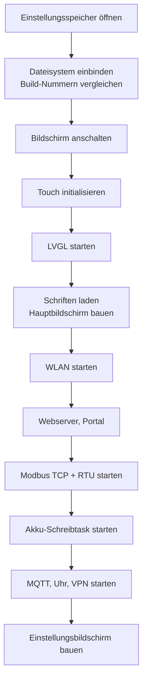

# Architektur — wie das Programm innen aussieht

Diese Seite ist für alle, die am Code arbeiten wollen. Begriffe wie „Task" oder „Priorität" sind im [Glossar](Glossar#computerbegriffe) erklärt.


## Die Bausteine

Jede Datei hat genau eine Aufgabe. Das macht es leicht, etwas zu finden, und schwer, versehentlich etwas anderes kaputt zu machen.

| Datei | Aufgabe |
| --- | --- |
| `main.c` | Startreihenfolge — und sonst nichts |
| `display.c` | Bildschirm anschalten, Helligkeit regeln |
| `touch.c` | Fingerpositionen vom Touchcontroller lesen |
| `lvgl_port.c` | LVGL mit diesem Chip verbinden, Bilddrehung, Zugriffssperre |
| `fonts.c` | Schriftarten aus der Schriftdatei berechnen (für die Umlaute) |
| `ui_flow.c` | der Hauptbildschirm: Kreise, Flusslinien, Fenster, Uhr, Schieber |
| `ui_settings.c` | der Einstellungsbildschirm mit acht Reitern und Tastatur |
| `modbus_tcp.c` | Geräte im Netzwerk abfragen, Energiemodell, SLS-Schutz |
| `modbus_rtu.c` | die zwei Zweidrahtleitungen, gefälschter Zähler, Selbsttest |
| `modbus_gw.c` | Modbus-Brücke: TCP-Server auf Port 502, reicht Anfragen an die RS485-Busse durch |
| `deye_ctrl.c` | Akku-Betriebsarten schreiben |
| `mqtt_fwd.c` | Werte veröffentlichen, Home Assistant einrichten |
| `wifi_mgr.c` | WLAN-Verwaltung, mehrere Netze, Suche |
| `captive.c` | Ersteinrichtungs-Portal (DNS-Umleitung und Webserver) |
| `web_mirror.c` | Display im Browser, Eingaben von dort, JSON-Schnittstellen |
| `ota.c` | Firmware-Updates, Notfallseite |
| `deye_web.c` | Register-Werkzeug im Browser |
| `ntp_client.c` | Uhrzeit und Zeitzonen |
| `wg_client.c` | VPN-Tunnel |
| `nvs_store.c` | alles, was gespeichert wird — an einer Stelle gebündelt |
| `assets_fs.c` | das kleine Dateisystem, Build-Nummer auslesen |

## Die Startreihenfolge

Die Reihenfolge in `app_main()` sieht willkürlich aus, ist es aber nicht. Jeder Schritt braucht etwas aus den vorherigen.



Vier Abhängigkeiten, die man kennen muss, weil ihre Verletzung jeweils einen echten Fehler verursacht hat:

**1. Der Einstellungsbildschirm kommt zuletzt.** Seine Reiter lesen ihre Werte nicht direkt aus dem Speicher, sondern aus den laufenden Programmteilen. Baut man ihn vorher, sind die noch leer — die Felder erscheinen leer, und wer dann „Speichern" drückt, überschreibt seine echten Einstellungen mit Leere. Das sah aus wie „die Einstellungen werden nicht gespeichert" und war tatsächlich das Gegenteil.

**2. Die Akku-Schreibtask kommt nach der Zweidrahtleitung.** Sie braucht deren Zugriffssperre. War die Reihenfolge falsch, stürzte das Gerät beim Start ab.

**3. Der Web-Mirror kommt nach WLAN und LVGL.** Er braucht den Netzwerkstapel und den Bildspeicher.

**4. Das VPN kommt nach der Uhr.** WireGuard braucht eine plausible Zeit für seinen Handschlag, siehe [Zeit und VPN](Zeit-und-VPN#wireguard-tunnel).

## Wer wann rechnen darf

Der Chip hat zwei Rechenkerne, aber viel mehr als zwei Aufgaben. Deshalb wechseln sich die Programmteile ab, und die **Priorität** entscheidet, wer bei Gleichzeitigkeit vorgeht: höhere Zahl gewinnt.

| Programmteil | Priorität | Kern | Aufgabe |
| --- | --- | --- | --- |
| Zweidrahtleitung A und B | 5 | — | Regelpfad: gefälschter Zähler, Deye auslesen |
| Bildschirm und Touch | 4 | 1 | zeichnen, Eingaben verarbeiten |
| Akku-Schreibtask | 4 | 0 | Register schreiben (wartet meist) |
| Netzwerk-Task des Netzzählers | 3 | — | der zeitkritische Zähler |
| alle anderen Netzwerk-Tasks | 2 | — | Solar-Wechselrichter und so weiter |

Die Überlegung dahinter in zwei Sätzen:

* **Der Regelpfad darf nie warten, weil der Bildschirm zeichnet.** Am anderen Ende hängt ein Wechselrichter, der eine Antwort erwartet. Deshalb Priorität 5, über allem anderen.
* **Die Bedienung darf nie ruckeln, weil ein Datenlogger hängt.** Deshalb liegen alle Netzwerk-Abfragen unter dem Bildschirm.

Innerhalb der Netzwerk-Abfragen rangiert der Netzzähler über den Solar-Wechselrichtern, weil sein Wert in die Regelung eingeht. Die Solarwerte müssen nur „irgendwann" aktuell sein — ob sie zwei Sekunden alt sind, sieht niemand.

Der Aggregator sammelt alle 800 Millisekunden die Ergebnisse ein und baut daraus das Gesamtbild.

## Das Energiemodell

```text
Haus  =  Solar  +  Akku  +  Netz
```

Vorzeichen: positiv heißt „fließt in die Hausverteilung hinein". Rechenbeispiel und die Ersatzwege für fehlende Quellen: [Modbus-TCP](Modbus-TCP#wie-der-hausverbrauch-berechnet-wird).

Zwei Regeln gelten im ganzen Programm, und sie sind wichtiger als jede einzelne Funktion:

**Keine Geisterwerte.** Fällt eine Quelle weg, wird der Kreis auf `--` gesetzt — nicht auf den letzten bekannten Wert. Ein alter Wert sieht aus wie ein aktueller, und darauf trifft man dann Entscheidungen.

**Frische vor Vollständigkeit.** Wer etwas steuert, fragt vorher `modbus_tcp_grid_w_fresh()` und hält still, wenn die Antwort „nein" ist. Lieber nichts tun als das Falsche.

## Was gespeichert wird

Alles läuft über `nvs_store.c`, damit es genau eine Stelle gibt, an der man nachsehen kann:

| Inhalt | Form |
| --- | --- |
| WLAN-Zugangsdaten (bis 10 Netze) | Datenblock |
| Passwort des eigenen WLANs | Text |
| Helligkeit, Kontrast, Standby, Ausrichtung | einzelne Zahlen |
| Geräteliste Netzwerk | Datenblock |
| Konfiguration Zweidrahtleitungen | Datenblock |
| MQTT, Uhr, VPN | je ein Datenblock |
| Netz-Sollwert | Zahl |
| Hauptschalter-Nennstrom | Zahl |

### Wie man Datenblöcke erweitert, ohne alles zu zerstören

Ein Datenblock ist einfach eine Kopie der Datenstruktur aus dem Programm. Das ist bequem, hat aber eine Falle: ändert man die Struktur, passt der gespeicherte Block nicht mehr, und die Werte werden falsch interpretiert.

Die Regel dagegen: **neue Felder werden immer hinten angehängt, niemals dazwischen eingefügt.** Dann kann ein alter, kürzerer Block einfach übernommen werden — die neuen Felder bleiben eben leer und werden mit Standardwerten gefüllt.

Als das Feld für den Anzeigenamen dazukam, wuchs der Eintrag über die alten 42 Byte hinaus. Deshalb gibt es dafür zusätzlich einen einmaligen Umzugspfad, der den alten Stand liest und in das neue Format überträgt.

Und wenn der Speicher doch einmal beschädigt ist: dann löscht ihn die Initialisierung und legt ihn neu an. Das Gerät startet mit Standardwerten — was unangenehm ist, aber besser, als überhaupt nicht zu starten.

## Wie das Bild entsteht

```text
LVGL zeichnet  (800 × 480, RGB565)
        ↓
PPA dreht 90°  →  Bildspeicher im PSRAM  (480 × 800)
        ↓  MIPI-DSI, 2 Leitungspaare
ST7701-Panel
        ↓  derselbe Speicher wird nochmal gelesen
JPEG-Encoder (Hardware)  →  Bildstrom auf Port 81
```

Der interessante Punkt ist das Ende: der [Web-Mirror](Web-Mirror) greift den **fertigen** Bildspeicher ab und zeichnet nichts neu. Deshalb kostet er fast keine Rechenzeit, und deshalb sieht man im Browser garantiert dasselbe wie auf dem Gerät. Die Begrenzung auf etwa 8 Bilder pro Sekunde hat nur einen Grund: den Bildspeicher nicht zu oft sperren, damit die Bedienung flüssig bleibt.

## Was absichtlich fehlt

Manchmal ist es aufschlussreicher zu wissen, was ein Projekt **nicht** tut:

* **Keine Passwörter auf den Webzugängen.** Das Gerät ist für ein vertrauenswürdiges Heimnetz gedacht; für Fernzugriff gibt es den VPN-Tunnel.
* **Keine Verschlüsselung bei MQTT.** Im Heimnetz vertretbar, über unsichere Netze nicht.
* **Kein Modbus-Server über Netzwerk.** Das Gerät fragt andere ab, aber niemand kann *es* über Netzwerk abfragen — dafür gibt es die JSON-Schnittstellen und MQTT.
* **Keine Datenhistorie.** Das Display zeigt den Augenblick. Verläufe, Statistiken und Diagramme macht Home Assistant, und das viel besser.

Das Letzte ist eine bewusste Entscheidung: ein Mikrocontroller mit 32 MB Speicher ist eine schlechte Datenbank. Werte weiterreichen ist die richtige Aufgabenteilung.
