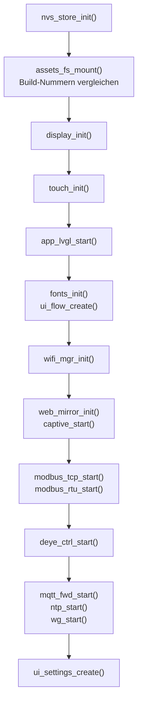

# Architektur


## Module

| Datei | Aufgabe |
| --- | --- |
| `main.c` | Bootreihenfolge |
| `display.c` | MIPI-DSI-PHY, ST7701, Backlight-PWM |
| `touch.c` | GT911 über I²C |
| `lvgl_port.c` | LVGL-9-Anbindung, Framebuffer, 90°-Rotation per PPA, Lock |
| `fonts.c` | Tiny-TTF-Schriften in vier Größen mit Bitmap-Rückfall |
| `ui_flow.c` | Hauptbildschirm: Gauges, Flusslinien, Popups, Uhr, Sollwert-Schieber |
| `ui_settings.c` | Einstellungsbildschirm, acht Tabs, Bildschirmtastatur |
| `modbus_tcp.c` | Multi-Geräte-Master, Worker pro IP, Aggregator, SLS-Schutz |
| `modbus_rtu.c` | zwei RS485-Busse, Master und Eastron-Emulation, Selbsttest |
| `deye_ctrl.c` | Akku-Modi, asynchroner FC16-Schreibpfad |
| `mqtt_fwd.c` | MQTT-Publish und HA-Auto-Discovery |
| `wifi_mgr.c` | STA/AP-Verwaltung, Mehrfach-Netze, Scan |
| `captive.c` | DNS-Hijack und Portal-Server |
| `web_mirror.c` | MJPEG-Spiegel, Eingabe-Injektion, JSON-Schnittstellen |
| `ota.c` | OTA-Endpunkte, Recovery-Seite, UI-Einfrieren |
| `deye_web.c` | Register-Werkzeug `/deye` |
| `ntp_client.c` | SNTP und Zeitzonen |
| `wg_client.c` | WireGuard-Client |
| `nvs_store.c` | gesamte Persistenz |
| `assets_fs.c` | SPIFFS-Partition `storage`, Build-Nummer lesen |

## Bootreihenfolge

Die Reihenfolge in `app_main()` ist nicht beliebig:



Drei Abhängigkeiten, die man kennen muss:

1. **`ui_settings_create()` ganz am Ende** — nach allen `*_start()`, weil die Tabs aus den Backend-Caches rendern. Vorher gebaut, wären sie leer und ein Speichern würde NVS überschreiben.
2. **`deye_ctrl_start()` nach `modbus_rtu_start()`** — die Schreibtask braucht den Anfrage-Mutex des RTU-Busses.
3. **`web_mirror_init()` nach `wifi_mgr_init()` und laufendem LVGL** — es braucht lwIP und den Framebuffer.

`ntp_start()` vor `wg_start()`: der WireGuard-Handschlag braucht eine gestellte Uhr.

## Tasks und Prioritäten

| Task | Prio | Kern | Aufgabe |
| --- | --- | --- | --- |
| RTU-Bus A / B | 5 | — | Regelpfad: Eastron-Emulation und Deye lesen |
| LVGL / Touch | 4 | 1 | Zeichnen und Eingabe |
| `deye_ctrl` | 4 | 0 | FC16-Schreibzugriffe (meist blockiert) |
| TCP-Worker (Netz / Deye-Zähler) | 3 | — | zeitkritische Zähler |
| TCP-Worker (PV etc.) | 2 | — | alles andere |

Die Logik dahinter: der **Regelpfad** darf nie warten, weil die UI zeichnet — deshalb 5. Die **UI** darf nie zäh werden, weil ein Datalogger hängt — deshalb liegen alle TCP-Poller darunter. Innerhalb der Poller rangiert der Netzzähler über den PV-Wechselrichtern, weil sein Wert in die Regelung eingeht; die PV-Werte müssen nur „irgendwann" aktuell sein.

Der Aggregator baut alle 800 ms das Energiemodell aus den Beiträgen der Worker.

## Energiemodell

```text
Haus  =  PV  +  Akku  +  Netz
```

Vorzeichen: positiv = in den Verteiler hinein. Ausführlich mit Ersatzwegen, Plausibilitätsprüfung und Hybrid-Aufteilung unter [Modbus-TCP](Modbus-TCP#energiemodell).

Zwei Regeln, die im ganzen Modell gelten:

* **Keine Geisterwerte.** Fällt eine Quelle weg, wird der Knoten auf `--` gesetzt, nicht auf den letzten bekannten Wert.
* **Frische vor Vollständigkeit.** Wer steuert, fragt `modbus_tcp_grid_w_fresh()` und bleibt passiv, wenn der Wert alt ist.

## Persistenz

Alles in NVS, über `nvs_store.c` gekapselt:

| Inhalt | Form |
| --- | --- |
| STA-Zugangsdaten (bis 10 Netze) | Blob |
| AP-Passwort | String |
| Helligkeit, Kontrast, Standby, Ausrichtung | Skalare |
| Modbus-TCP-Geräteliste | Blob (Struct-Array) |
| Modbus-RTU-Konfiguration | Blob |
| MQTT-, NTP-, WireGuard-Konfiguration | je ein Blob |
| Netz-Sollwert | Integer |
| SLS-Nennstrom | Byte |

**Blob-Migration:** neue Felder werden ausschließlich **angehängt**, damit ein älteres Layout in-place weiterverwendet werden kann. Für den Sprung des Geräteeintrags von 42 Byte (`devs4`) auf das aktuelle Layout gibt es einen einmaligen Migrationspfad.

Läuft NVS voll oder ist die Partition beschädigt, löscht `nvs_store_init()` sie und initialisiert neu — das Gerät startet dann mit Standardwerten statt gar nicht.

## Versionierung

Eine Zahl für alles: `version.json` → Pre-Build-Hook → `main/build_info.h` (Firmware, UI) und `data/build.txt` (SPIFFS). Beim Booten vergleicht die Firmware beide und meldet einen Versatz. Details unter [Bauen und Flashen](Bauen-und-Flashen#build-zähler).

## Grafik-Pipeline

```text
LVGL zeichnet (800×480, RGB565)
   ↓ esp_lvgl_port
PPA dreht 90°  →  Framebuffer im PSRAM (480×800)
   ↓ MIPI-DSI, 2 Lanes
ST7701-Panel
   ↓ Framebuffer wird direkt gelesen (kein erneutes Rendern)
JPEG-Encoder (Hardware)  →  MJPEG auf :81
```

Der Web-Mirror greift also am Ende der Kette ab und rendert nichts neu. Deshalb kostet er kaum Rechenzeit — die Begrenzung auf etwa 8 Bilder pro Sekunde dient allein dazu, die Konkurrenz um den LVGL-Lock klein zu halten.

## Was bewusst nicht vorhanden ist

* **Keine Authentifizierung** auf den HTTP-Endpunkten. Das Gerät ist für ein vertrauenswürdiges Netz gedacht; Fernzugriff über WireGuard.
* **Keine TLS-Verschlüsselung** für MQTT.
* **Kein Modbus-TCP-Server** — das Gerät ist Master (TCP) bzw. Master/Slave (RTU), aber kein TCP-Slave.
* **Kein Datenverlauf.** Historie und Statistik macht Home Assistant, das Display zeigt den Augenblick.
