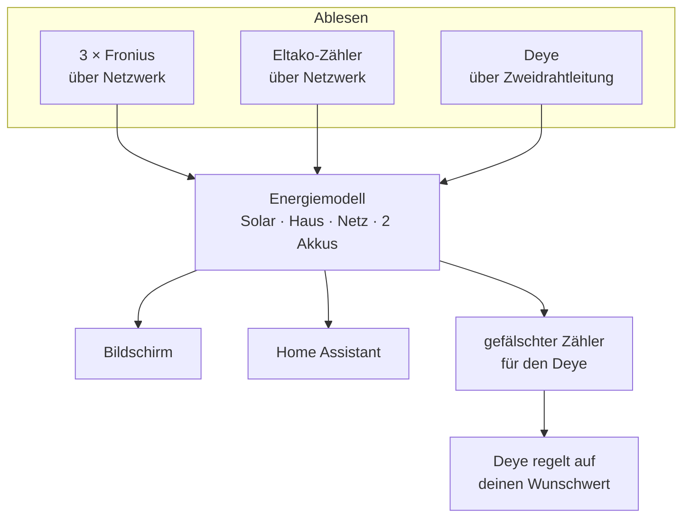

# Deye-Display — Wiki

Hier steht, was dieses Gerät ist, wie es funktioniert und wie man es baut, einrichtet und reparieren kann. Die Seiten sind so geschrieben, dass man sie ohne Vorwissen lesen kann — Fachbegriffe werden erklärt, und was hier nicht erklärt wird, findest du im **[Glossar](Glossar)**.


## Worum geht es überhaupt?

Stell dir ein Haus mit Solaranlage vor. Da hängen mehrere Geräte, die alle irgendwas mit Strom machen:

* **drei Solar-Wechselrichter** von Fronius, die den Strom der Solarmodule nutzbar machen
* ein **Hausakku** (BYD), der an einem dieser Wechselrichter hängt
* ein **zweiter Wechselrichter** von Deye — mit einem eigenen Akku
* ein **Stromzähler** von Eltako an der Stelle, wo das Haus am öffentlichen Netz hängt

Das Problem: **keines dieser Geräte weiß etwas von den anderen.** Jeder Hersteller hat seine eigene App, sein eigenes Portal, seine eigene Sicht auf die Welt. Niemand zeigt dir das Gesamtbild.

Dieses Projekt baut aus einem fertigen Touchdisplay mit eingebautem Mikrocontroller genau dieses Gesamtbild. Es fragt alle Geräte selbst ab, rechnet daraus zusammen, was im Haus passiert, und zeigt es auf einem Touchscreen an — in Echtzeit, ohne Cloud, ohne App, ohne Konto.

Und dann geht es noch einen Schritt weiter: es **redet zurück**. Es kann dem Deye-Wechselrichter sagen, was er tun soll. Wie das geht, ist der interessanteste Teil dieses Projekts — siehe unten.

## Der Trick mit dem gefälschten Zähler

Der Deye-Wechselrichter will wissen, wie viel Strom gerade ins Netz geht oder aus dem Netz kommt. Dafür hat er einen eigenen Anschluss, an den normalerweise ein Stromzähler kommt. Sein Ziel ist immer dasselbe: **möglichst genau null am Netzanschluss** — also nichts einkaufen, nichts verschenken.

Jetzt hängt an diesem Anschluss aber nicht ein echter Zähler, sondern unser Display. Und das Display sagt nicht die reine Wahrheit, sondern:

```text
was der Deye zu hören bekommt  =  echter Wert  −  Wunschwert
```

Ein Beispiel. Du stellst am Display „−350 W" ein, also: „ich will, dass 350 Watt ins Netz eingespeist werden". Real fließen gerade 0 Watt. Das Display meldet dem Deye also `0 − (−350) = +350 W`, sprich: „du beziehst gerade 350 Watt aus dem Netz!"

Der Deye glaubt das, denkt „das muss ich abstellen" und fährt seine Leistung so weit hoch, bis er glaubt, wieder bei null zu sein. Weil aber seine Information um 350 Watt verschoben ist, landet er in Wirklichkeit bei −350 Watt — genau bei deinem Wunschwert.

Das ist der Kern: **wir verschieben nicht den Wechselrichter, wir verschieben seine Wahrnehmung.** Man muss dafür nichts an seinen Einstellungen ändern und keine geheime Schnittstelle kennen.

> [!WARNING]
> Genau hier liegt aber auch die Gefahr. Wenn wir dem Deye eine Zahl liefern, die sich nicht mehr ändert (weil unsere Messung hängt), regelt er gegen einen Wert, der nicht mehr der Realität entspricht — und dreht immer weiter auf. Genau das ist hier einmal passiert: **15 kW Einspeisung**. Die Geschichte und die eingebaute Sicherung stehen unter [Fehlersuche](Fehlersuche#die-15-kw-geschichte).

## Was das Gerät alles kann

| | |
| --- | --- |
| **Messen** | Bis zu 8 Geräte über das Netzwerk plus 2 Geräte über Zweidrahtleitung gleichzeitig abfragen |
| **Rechnen** | Aus Solarstrom, Netz und Akkus ausrechnen, wie viel das Haus gerade verbraucht |
| **Anzeigen** | Fünf Kreise mit animierten Flusslinien, Uhr, Verbindungsstatus — antippbar für Details |
| **Steuern** | Den Deye-Akku zwangsweise laden oder entladen, mit Schutz gegen Überlast |
| **Weitergeben** | Alle Werte an Home Assistant schicken, inklusive Schalter zum Zurücksteuern |
| **Fernwarten** | Das ganze Display im Browser anzeigen und bedienen, Updates über WLAN einspielen |

## Wo fange ich an?

**Du willst verstehen, wie es funktioniert:**

1. [Glossar](Glossar) — alle Fachbegriffe auf einer Seite
2. [Architektur](Architektur) — wie das Programm innen aufgebaut ist
3. [Modbus-TCP](Modbus-TCP) und [Modbus-RTU](Modbus-RTU) — wie die Geräte abgefragt werden

**Du willst es nachbauen:**

1. [Hardware](Hardware) — was du kaufen und wie du es verkabeln musst
2. [Bauen und Flashen](Bauen-und-Flashen) — Programm übersetzen und aufs Gerät bringen
3. [WLAN und Captive Portal](WLAN-und-Captive-Portal) — Ersteinrichtung
4. [Einstellungen](Einstellungen) — alle Menüs erklärt

**Du willst es bedienen oder erweitern:**

1. [Deye-Steuerung](Deye-Steuerung) — Akku laden und entladen (**bitte vorher lesen**)
2. [MQTT und Home Assistant](MQTT-und-Home-Assistant) — Anbindung an die Hausautomatisierung
3. [Web-Mirror](Web-Mirror) — Display im Browser und das Register-Werkzeug
4. [Zeit und VPN](Zeit-und-VPN) — Uhr und Fernzugriff
5. [OTA und Recovery](OTA-und-Recovery) — Updates über WLAN

**Es funktioniert etwas nicht:** [Fehlersuche](Fehlersuche)

## Wie die Daten fließen



## Zum Schluss ein ernstes Wort

Das ist ein Bastelprojekt, aber es hängt an einer echten Hausinstallation mit einem Akku, der mehrere Kilowatt liefern kann, und an einem Netzanschluss, für den Regeln gelten.

* Arbeiten an Netzanschluss, Zähler und Verkabelung gehören in fachkundige Hände.
* Die Registeradressen des Deye sind durch Ausprobieren gefunden worden, nicht aus einem offiziellen Handbuch. Bei einem anderen Modell oder einer anderen Gerätesoftware können sie etwas anderes bedeuten.
* Die eingebauten Schutzfunktionen sind Software. Software hat Fehler. Sie ersetzen keine Sicherungen.
* Auf keinem der Web-Zugänge gibt es ein Passwort. Das Gerät gehört in ein Netz, dem du vertraust.

Wenn du damit umgehen kannst: viel Spaß. Es ist ein sehr befriedigendes Projekt.
