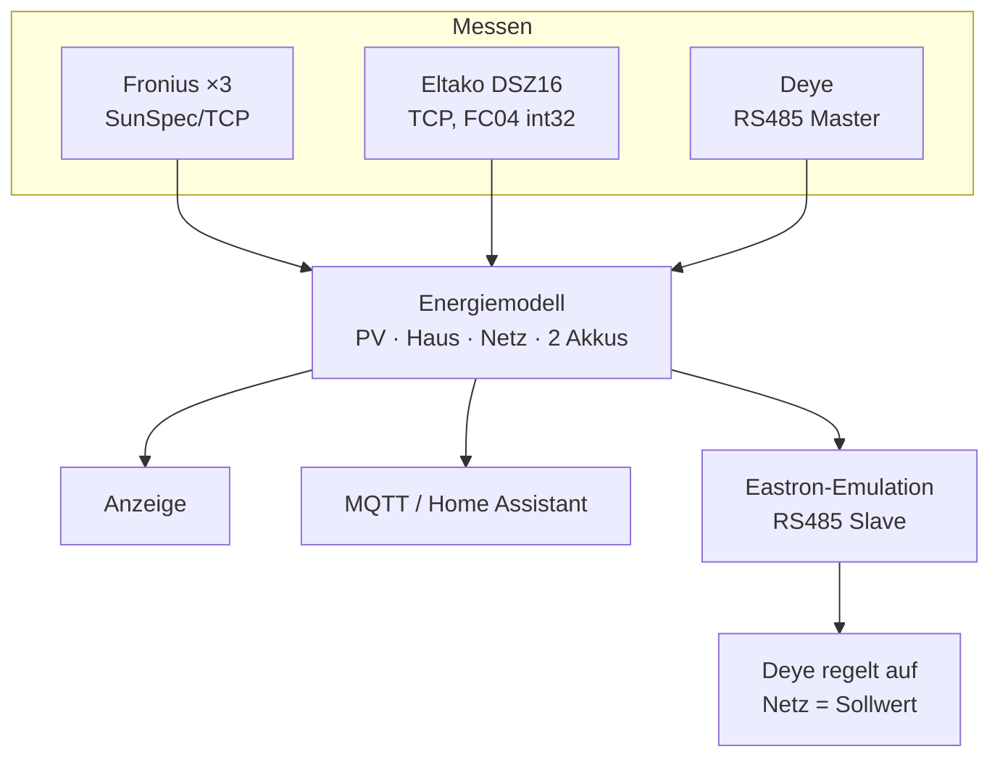

# Deye-Display — Wiki

Firmware für ein **GUITION JC4880P443C** (ESP32-P4 + ESP32-C6, 4,3″ 480×800): Energie-Dashboard, Messwertsammler und Regel-Bindeglied für einen **Deye SG04LP3** Hybrid-Wechselrichter.

## Einstieg

| Seite | Inhalt |
| --- | --- |
| **[Hardware](Hardware)** | Board, Panel, Touch, Pinbelegung, RS485-Transceiver |
| **[Bauen und Flashen](Bauen-und-Flashen)** | PlatformIO, Build-Zähler, SPIFFS-Image, erste Installation |
| **[OTA und Recovery](OTA-und-Recovery)** | Update über WiFi, zwei Slots, Rollback, Notfallseite |
| **[WLAN und Captive Portal](WLAN-und-Captive-Portal)** | Erste Einrichtung, mehrere Netze, AP-Fallback |

## Betrieb

| Seite | Inhalt |
| --- | --- |
| **[Einstellungen](Einstellungen)** | Referenz aller acht Tabs |
| **[Modbus-TCP](Modbus-TCP)** | Geräteliste, Rollen, Hersteller-Profile, Energiemodell |
| **[Modbus-RTU](Modbus-RTU)** | Zwei RS485-Busse, Eastron-SDM630-Emulation, Selbsttest |
| **[Deye-Steuerung](Deye-Steuerung)** | Akku-Modi, Steuerregister, SLS-Export-Schutz |
| **[MQTT und Home Assistant](MQTT-und-Home-Assistant)** | Topics, Auto-Discovery, Steuerung von außen |
| **[Web-Mirror](Web-Mirror)** | Display im Browser, Register-Werkzeug, JSON-Schnittstellen |
| **[Zeit und VPN](Zeit-und-VPN)** | SNTP, Zeitzonen, WireGuard-Tunnel |

## Hintergrund

| Seite | Inhalt |
| --- | --- |
| **[Architektur](Architektur)** | Module, Tasks, Prioritäten, Bootreihenfolge, Persistenz |
| **[Fehlersuche](Fehlersuche)** | Symptome, Ursachen, bekannte Fallgruben |

---

## Was hier eigentlich passiert

Die Anlage, für die das Gerät gebaut wurde, ist gemischt: drei Fronius-Wechselrichter (einer davon Hybrid mit BYD-Speicher), ein Eltako-Netzzähler am Übergabepunkt und ein Deye-Hybrid mit eigenem Akku. Keine Komponente kennt die andere.

Das Display macht daraus ein Bild — und mehr: es gibt dem Deye die Netzmessung, die dieser für seine eigene Regelung braucht. Am Zähler-Port des Deye verhält sich das Gerät wie ein Eastron SDM630 und meldet nicht den wahren Netzbezug, sondern den wahren Netzbezug **minus einem Sollwert**. Damit lässt sich der Arbeitspunkt der ganzen Anlage am Übergabepunkt verschieben, ohne im Deye etwas umzustellen.

Zusätzlich schreibt das Gerät direkt in die Steuerregister des Deye — Zwangsladen und Zwangsentladen mit einstellbarer Leistung, aus dem Touch-Menü oder aus Home Assistant.

> [!WARNING]
> Das Projekt greift in eine Netzanlage mit Batteriespeicher ein. Vor dem ersten Schreibzugriff die Seite [Deye-Steuerung](Deye-Steuerung) lesen — insbesondere den Abschnitt über eingefrorene Messwerte.
