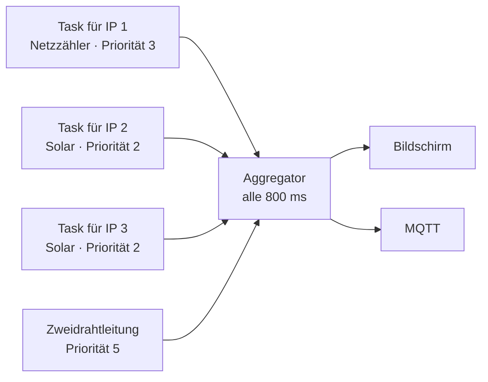

# Modbus-TCP — Geräte über das Netzwerk auslesen

Hier geht es um die Geräte, die über das normale Netzwerk abgefragt werden: die Fronius-Wechselrichter und der Eltako-Stromzähler. Wenn dir „Modbus" oder „Register" nichts sagen, lies zuerst das [Glossar](Glossar#wie-geräte-miteinander-reden).

## Die Grundidee

Jedes Gerät im Netzwerk hat eine IP-Adresse. Fragt man es auf Port 502 nach einem Register, antwortet es mit einer Zahl. Genau das macht diese Firmware — für bis zu **8 Geräte gleichzeitig**.

Ein Gerät wird durch zwei Angaben beschrieben:

* **Hersteller** — sagt, *wie* man mit dem Gerät redet, also in welchen Registern welche Werte stehen.
* **Rolle** — sagt, *wofür* der Wert gut ist, also welchen Kreis auf dem Bildschirm er füttert.

Dazu kommen die üblichen Verbindungsangaben: IP, Port, Slave-ID, wie oft gefragt wird und wie lange man auf Antwort wartet.

## Hersteller: welche Sprache spricht das Gerät?

| Hersteller | Wie gelesen wird | Besonderheit |
| --- | --- | --- |
| **Fronius** | FC03, nach dem SunSpec-Standard | Sehr angenehm: das Gerät sagt selbst, wo was steht. Die Firmware sucht die Kennung „SunS" und liest dann die Liste der verfügbaren „Modelle". |
| **Deye** | FC03, eigenes Register-Layout | Kein Standard. Die Adressen mussten von Hand ermittelt werden. Gelesen wird in zwei Blöcken (ab 586 und ab 644), weil einzelne Abfragen zu langsam wären. |
| **Eltako** | FC04, Werte als int32 | Zähler der Baureihen DSZ15DZ und DSZ16DZ(E). |

### Die Falle mit dem Eltako-Zähler

Das ist ein Fehler, in den man leicht tappt, deshalb ausführlich:

Es gibt einen extrem verbreiteten Zähler namens Eastron SDM630. Der legt seine Gesamtleistung in Register `0x0034` ab, als **Fließkommazahl** (float32, verteilt auf zwei Register).

Der Eltako-Zähler legt seine Gesamtleistung in **dasselbe Register** — aber als **ganze Zahl** (int32).

Dieselbe Adresse, dieselbe Länge, komplett andere Bedeutung der Bits. Liest man das eine als das andere, kommen keine Fehlermeldungen, sondern schlicht Unsinn heraus: `nan` (keine Zahl) oder gigantische Werte.

Genau deshalb muss man den Hersteller **von Hand** einstellen, und es gibt keine automatische Erkennung. Sie wäre nicht zuverlässig möglich.

### Was SunSpec für uns tut

Bei Fronius-Geräten ist es viel einfacher, weil SunSpec ein selbstbeschreibender Standard ist. An einer festen Stelle steht die Kennung „SunS", danach eine Liste von Blöcken mit Nummern:

| Modell-Nummer | Inhalt |
| --- | --- |
| 101–103 (oder 111–113) | Wechselstrom-Leistung des Wechselrichters |
| 124 | Batteriespeicher — vor allem der Ladezustand |
| 160 | die einzelnen Solar-Stränge (MPPT) |
| 201–204 | ein angeschlossener Stromzähler |

Die Firmware läuft diese Liste **einmal** ab und merkt sich, wo was steht. Vorher wurde die Liste für jeden einzelnen Wert bei jeder Abfrage neu durchsucht — das waren 50 bis 100 Modbus-Zugriffe pro Runde, und alles war entsprechend langsam.

## Rollen: wofür ist der Wert gut?

| Rolle (so heißt sie im Gerät) | Füttert | Erklärung |
| --- | --- | --- |
| `Netz-Zaehler` | den Netz-Kreis | Der Zähler am Hausanschluss. Das ist der wichtigste Wert überhaupt, weil er auch in die Regelung eingeht. |
| `Erzeugungs-Zaehler` | den Solar-Kreis | Ein Zähler, der nur die Erzeugung misst. |
| `Wechselrichter` | den Solar-Kreis (+ Akku) | Bei einem Hybrid kommen Batterieleistung und Ladezustand dazu. |
| `Batterie` | den Akku-Kreis | Ein eigenständiger Speicher. |
| `Deye-AC-Zaehler` | die Deye-Leistung | Ein Zähler direkt vor dem Deye-Wechselrichter. |

> [!NOTE]
> Diese Namen erscheinen im Gerät genau so — ohne Umlaut. Warum, steht im [Glossar](Glossar#die-rollen-im-energiemodell).

## Ein Hybrid rechnet anders

Das ist ein Punkt, an dem man leicht falsche Zahlen bekommt.

Ein normaler Solar-Wechselrichter macht aus Sonnenstrom Wechselstrom. Was er abgibt, *ist* die Solarleistung. Fertig.

Ein Hybrid-Wechselrichter hat aber zusätzlich eine Batterie. Was er abgibt, ist:

```text
abgegebene Leistung  =  Solarleistung  +  was die Batterie beisteuert
```

Wenn die Batterie gerade entlädt, ist die abgegebene Leistung also **größer** als die Solarleistung. Würde man einfach die abgegebene Leistung als „Solar" anzeigen, hätte man an einem trüben Abend plötzlich 4 kW Sonnenstrom — obwohl die Sonne längst weg ist und in Wahrheit die Batterie arbeitet.

Die Firmware erkennt Hybride daran, dass sie **SunSpec-Modell 124** anbieten (den Speicher-Block). Dann rechnet sie:

* **Solar** = die Gleichstromleistung der Module (Modell 160) — reine Erzeugung
* **Batterie** = abgegebene Leistung − Solarleistung (positiv = entladen, negativ = laden)

Fehlt Modell 124, ist es ein normaler Wechselrichter: Solar = abgegebene Leistung, keine Batterie.

## Alle gleichzeitig fragen, nicht der Reihe nach

Ein naives Programm würde alle Geräte hintereinander abfragen. Das Problem: manche Wechselrichter-Datenlogger antworten sehr langsam — manchmal über eine Sekunde. In der Zeit wartet alles andere, auch der wichtige Netzzähler.

Deshalb bekommt hier **jede IP-Adresse ihren eigenen Programmteil** (Task), der unabhängig von den anderen fragt. Ein weiterer Programmteil, der Aggregator, sammelt die Ergebnisse alle 800 Millisekunden ein und rechnet daraus das Gesamtbild.



Die Prioritäten sind bewusst so gewählt:

| Was | Priorität | Begründung |
| --- | --- | --- |
| Regelpfad (Zweidrahtleitung) | 5 | darf nie warten — hier hängt der Wechselrichter dran |
| Bildschirm und Touch | 4 | soll sich flüssig anfühlen |
| Task mit dem Netzzähler | 3 | wichtiger als Solar, weil der Wert in die Regelung geht |
| alle anderen Tasks | 2 | dürfen warten |

Der Grundsatz dahinter: **die Bedienung darf nicht ruckeln, weil ein Datenlogger hängt — und die Regelung darf nicht warten, weil der Bildschirm zeichnet.**

Die Verbindungen bleiben übrigens offen, statt für jede Abfrage neu aufgebaut zu werden. Das spart pro Abfrage einige Millisekunden und viele Netzwerkkanäle.

## Wie der Hausverbrauch berechnet wird

Der Hausverbrauch wird **nicht gemessen** — dafür bräuchte man einen weiteren Zähler. Er wird ausgerechnet:

```text
Haus  =  Solar  +  Akku  +  Netz
```

Alle Vorzeichen so gedacht: *positiv = fließt in die Hausverteilung hinein*.

Ein Beispiel: Solar liefert 6,9 kW, die Akkus laden mit zusammen 3,6 kW (also −3,6), und 0,6 kW gehen ins Netz raus (also −0,6):

```text
6,9  +  (−3,6)  +  (−0,6)  =  2,7 kW Hausverbrauch
```

Genau das zeigt der Screenshot auf der Startseite.

Wenn eine Quelle fehlt, gibt es Ersatzwege: ist ein Deye eingerichtet, liefert der notfalls seine eigenen Messwerte für Solar und Netz. Fehlt beides, wird direkt sein gemessener Hausverbrauch genommen.

### Warum manchmal `--` dasteht

Sehr bewusste Entscheidung: **wenn eine Quelle wegfällt, zeigt der Kreis `--` statt des letzten bekannten Werts.**

Das sieht erst mal schlechter aus. Es ist aber viel besser, weil ein eingefrorener alter Wert wie ein aktueller aussieht. Man denkt, alles sei in Ordnung, und trifft Entscheidungen auf Basis einer Zahl von vor zwei Stunden. Bei einem System, das in die Regelung eingreift, ist das gefährlich.

### Plausibilitätsprüfung

Jeder Wert wird zweimal geprüft — beim Lesen und beim Zusammenrechnen. Verworfen wird alles, was keine echte Zahl ist oder über **100 kW** liegt. Zum Vergleich: ein 35-Ampere-Hausanschluss schafft etwa 24 kW. Ein Wert über 100 kW ist also mit Sicherheit ein Lesefehler.

Im Protokoll sieht das so aus:

```text
W modbus_tcp: agg: implausible netz 8388608 W skipped
```

Meist steht dahinter das falsche Hersteller-Profil.

## Zeiteinstellungen pro Gerät

| Einstellung | Standard | Bereich | Bedeutung |
| --- | --- | --- | --- |
| Poll-Intervall | 2000 ms | 200 … 60000 ms | wie oft gefragt wird |
| Timeout | 500 ms | 100 … 10000 ms | wie lange auf Antwort gewartet wird |

Bei den eigentlichen Leseoperationen gilt eine Untergrenze von 2 Sekunden, egal was eingestellt ist — einfach weil manche Datenlogger so langsam sind und man sonst nie eine Antwort bekäme.

## Die Frische-Garantie

Das ist die wichtigste Funktion im ganzen Programm. Sie heißt `modbus_tcp_grid_w_fresh()` und beantwortet die Frage: *„Wie hoch ist die Netzleistung — aber nur, wenn du es wirklich weißt?"*

Sie gibt nur dann einen Wert heraus, wenn er innerhalb einer vorgegebenen Zeitspanne wirklich von einem Zähler gelesen wurde. Sonst sagt sie „nein". „Nein" kommt in drei Fällen: kein Netzzähler eingerichtet, der Wert ist zu alt, oder es wurde gerade umkonfiguriert und noch nichts gelesen.

> [!WARNING]
> **Alles, was den Wechselrichter steuert, muss über diese Funktion gehen und bei „nein" die Finger stillhalten.** Ein Regelkreis, der auf eine eingefrorene Zahl reagiert, dreht immer weiter auf — er sieht ja keine Wirkung. Hier hat das einmal 15 kW Einspeisung erzeugt. Die ganze Geschichte: [Fehlersuche](Fehlersuche#die-15-kw-geschichte).

Aus dem gleichen Grund wird der Netzwert nach jedem Speichern der Geräteliste absichtlich für ungültig erklärt, bis wieder frisch gelesen wurde.

## Wie die Einstellungen gespeichert werden

Die Geräteliste liegt als Datenblock im NVS-Speicher. Damit ein Update nicht alle Einstellungen zerstört, gilt eine Regel: **neue Felder werden immer nur hinten angehängt, nie dazwischen eingefügt.** Dann kann ein alter Datenblock einfach weiterverwendet werden — die neuen Felder sind dann eben leer.

Als das Feld für den Anzeigenamen dazukam, wurde der Datensatz größer. Für den alten Stand (42 Byte pro Eintrag) gibt es deshalb einen einmaligen Umzugspfad beim Laden.

## Werte von außen abfragen

```bash
curl -s http://<ip-des-geräts>/api/devices
```

```json
[{"name":"","ip":"10.0.0.18","slave":1,"mfr":"Eltako","role":"Netz-Zaehler",
  "conn":1,"pv":0,"w":-685,"soc":0},
 {"name":"Ost","ip":"10.0.0.30","slave":1,"mfr":"Fronius","role":"Wechselrichter",
  "conn":1,"pv":690,"w":0,"soc":0}]
```

`conn` ist 1, wenn das Gerät antwortet. Dieselben Angaben zeigt auch das Fenster, das aufgeht, wenn du auf dem Hauptbildschirm den Solar-Kreis antippst.
