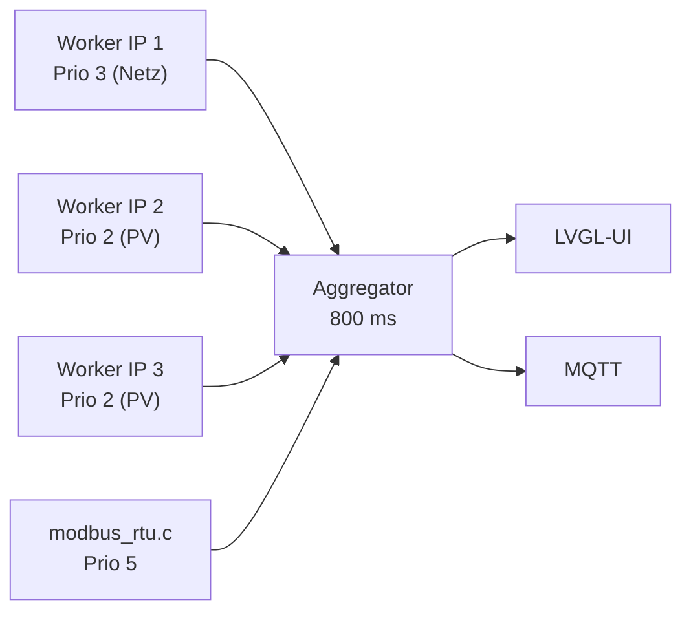

# Modbus-TCP

Bis zu **8 Geräte**, jedes einzeln konfiguriert. Ein Gerät wird beschrieben durch **Hersteller** (welches Registerprofil gilt) und **Rolle** (welchen Wert es im Energiemodell liefert) — plus IP, Port, Slave-ID, Poll-Intervall und Timeout.

## Hersteller-Profile

| Hersteller | Funktionscode | Registerprofil |
| --- | --- | --- |
| **Fronius** | FC03 | SunSpec. Modelle 101–103 (int) bzw. 111–113 (float) für AC-Leistung, 124 für Speicher-SoC, 160 für MPPT-Strings, 201–204 für Zähler |
| **Deye** | FC03 | natives SG04LP3-Layout, gelesen in zwei Blöcken (586 + 53 Register, 644 + 40 Register) |
| **Eltako** | FC04 | DSZ15DZ / DSZ16DZ(E): **int32-Watt**, ausdrücklich *kein* SDM630-float |

> [!IMPORTANT]
> Der Eltako-Zähler liegt auf derselben Adresse (`0x0034`), auf der ein Eastron SDM630 seinen float32-Gesamtwert führt — liefert dort aber int32. Wer das Profil verwechselt, liest `nan`. Genau deshalb gibt es die Hersteller-Auswahl und keine Auto-Erkennung.

## Rollen

| Rolle | Speist | Bemerkung |
| --- | --- | --- |
| `Netz-Zaehler` | Netz-Knoten | Zähler am Netzübergabepunkt. Quelle für die [Eastron-Emulation](Modbus-RTU). |
| `Erzeugungszaehler` | PV-Knoten | Zähler vor dem Wechselrichter |
| `Wechselrichter` | PV-Knoten (+ Akku) | Fronius-Hybrid liefert zusätzlich BYD-Leistung und -SoC, Deye zusätzlich Akku |
| `Batterie` | Akku-Knoten (BYD) | dedizierter Speicher |
| `Deye-Zaehler` | Deye-AC-Leistung | Zähler direkt vor dem Deye |

## Fronius-Hybrid richtig rechnen

Ein Fronius-Gerät mit SunSpec-Modell 124 ist ein **Hybrid** (Speicher vorhanden). Dann gilt:

```text
AC (Modell 103)  =  Solar-DC (Modell 160)  +  Akku-Entladung
```

Daraus folgt die Aufteilung:

* **PV** = Solar-DC (reine Erzeugung, ohne Akku-Anteil)
* **BYD** = AC − Solar-DC (positiv = Entladung, negativ = Ladung)

Ein reiner String-Wechselrichter hat kein Modell 124: dann ist PV = AC und es gibt keinen Akku-Anteil. Ohne diese Unterscheidung würde die Akku-Entladung als PV-Erzeugung gezählt.

## Parallel pollen

Jede **IP** bekommt ihre eigene Worker-Task mit eigenem Socket. Ein separater Aggregator baut daraus alle 800 ms das Energiemodell.



Gründe für dieses Muster:

* Ein Wechselrichter-Datalogger, der auf eine Anfrage sekundenlang nicht antwortet, darf den zeitkritischen Netzzähler nicht ausbremsen.
* Die Task-Prioritäten liegen **unter** der LVGL-/Touch-Task (4), damit Bedienung nie zäh wird. Ausnahme ist der Worker, dem ein `Netz-Zaehler` oder `Deye-Zaehler` gehört: der läuft auf 3 und rangiert damit über den PV-Workern.
* Die SunSpec-Struktur wird **einmal** ermittelt und pro Gerät gecacht. Vorher wurde die Modell-Liste für jeden Wert bei jedem Poll neu durchlaufen — 50 bis 100 Modbus-Lesevorgänge pro Runde.
* Sockets bleiben offen (persistente Verbindungen).

Prioritätsreihenfolge in der Sache: **1.** Netzzähler lesen → **2.** an den Deye weitergeben (RTU) → **3.** Deye lesen (RTU) → **4.** PV → **5.** BYD.

## Energiemodell

```text
Haus  =  PV  +  Akku  +  Netz
```

Vorzeichen: positiv = in den Verteiler hinein. Netz positiv = Bezug, negativ = Einspeisung; Akku positiv = Entladung, negativ = Ladung. Negative Hausverbrauchswerte werden auf 0 begrenzt.

Fällt PV oder Netz aus, greift ein Ersatzweg: ist ein Deye-Gerät vorhanden, liefert dieses `deye_mppt` als PV und `deye_ct` als Netz; sind beide Hauptquellen weg, wird `deye_load` direkt als Hausverbrauch genommen.

**Plausibilitätsprüfung** in zwei Stufen — beim Lesen und nochmals in der Aggregation. Verworfen wird alles, was nicht endlich ist oder 100 kW überschreitet (deutlich über einem 35-A-Drehstromanschluss mit etwa 24 kW). Verworfene Werte erscheinen im Log:

```text
W modbus_tcp: agg: implausible netz 8388608 W skipped
```

Fällt eine Quelle ganz weg (Gerät deaktiviert, entfernt, Wert veraltet), wird der Knoten auf `--` zurückgesetzt — er zeigt niemals einen eingefrorenen alten Wert.

## Timing pro Gerät

| Parameter | Standard | Bereich |
| --- | --- | --- |
| Poll-Intervall | 2000 ms | 200 … 60000 ms |
| Timeout | 500 ms | 100 … 10000 ms |

Der Timeout gilt für Verbindungsaufbau und Lebendigkeitsprüfung; für die eigentlichen Leseoperationen gilt eine Untergrenze von 2 s, weil manche Datalogger schlicht langsam sind.

## Frische-Garantie für den Regelpfad

`modbus_tcp_grid_w_fresh(&w, max_age_ms)` gibt die Netzleistung **nur** zurück, wenn sie innerhalb der angegebenen Zeitspanne aus einem echten Zählerzugriff stammt. `false` bedeutet: keine Netzquelle konfiguriert, Wert veraltet oder seit einer Umkonfiguration noch nichts gelesen.

> [!WARNING]
> Alles, was den Wechselrichter **steuert**, muss diese Funktion benutzen und bei `false` passiv bleiben. Ein eingefrorener Wert in einem laufenden Regelkreis hat hier einmal eine Einspeisung von 15 kW ausgelöst. Details unter [Modbus-RTU](Modbus-RTU) und [Deye-Steuerung](Deye-Steuerung).

Beim Speichern einer neuen Gerätekonfiguration wird der Netzwert bewusst als **ungültig** markiert, bis ein frischer Messwert vorliegt.

## Persistenz und Migration

Die Geräteliste liegt als Blob in NVS. Neue Felder werden ausschließlich **angehängt**, sodass ein älteres Layout beim Laden in-place übernommen wird; für das vorherige Layout (`devs4`, 42 Byte pro Eintrag) gibt es einen einmaligen Migrationspfad. Konkret ist so das Feld `name` (Anzeigename) nachgerüstet worden.

## Livewerte abfragen

```bash
curl -s http://<ip>/api/devices
```

```json
[{"name":"","ip":"10.0.0.18","slave":1,"mfr":"Eltako","role":"Netz-Zaehler",
  "conn":1,"pv":0,"w":-685,"soc":0},
 {"name":"Ost","ip":"10.0.0.30","slave":1,"mfr":"Fronius","role":"Wechselrichter",
  "conn":1,"pv":690,"w":0,"soc":0}]
```

Dieselben Werte zeigt das Popup, wenn man auf dem Hauptbildschirm den PV-Knoten antippt.
