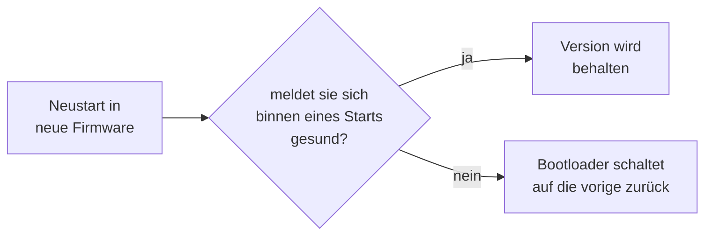

# Updates über WLAN und Notfallrettung

Nach der ersten Installation über USB braucht man kein Kabel mehr. Das Gerät kann seine eigene Firmware über das Netzwerk austauschen. Das nennt man **OTA** — *Over The Air*.

## Warum das sicher ist: zwei Speicherabschnitte

Ein Firmware-Update ist eigentlich ein riskanter Vorgang: man überschreibt genau das Programm, das gerade läuft. Bricht die Übertragung in der Mitte ab, ist das Gerät ein Briefbeschwerer.

Deshalb gibt es hier **zwei Programm-Abschnitte** im Speicher, `ota_0` und `ota_1`, je 4 MB groß. Es läuft immer nur einer davon.


Geschrieben wird immer in den, der gerade **nicht** läuft. Erst wenn die neue Version komplett und geprüft angekommen ist, wird der Merkzettel umgestellt und neu gestartet. Geht beim Übertragen etwas schief, passiert einfach nichts — die alte Version läuft weiter.

Und wenn die neue Version zwar startet, sich aber falsch verhält? Dann gibt es den **Rollback**: zurück auf den anderen Abschnitt, wo die alte Version noch unangetastet liegt.

## Der automatische Rückfall

Es gibt einen Fall, den das Zwei-Abschnitte-Prinzip allein nicht abfängt: die neue Firmware kommt **vollständig und heil** an, startet aber nicht. Dann ist der Merkzettel längst umgestellt, das Gerät bootet immer wieder in die kaputte Version — und weil es dabei nie ins WLAN kommt, ist auch die Notfallseite weg. Übrig bleibt nur das USB-Kabel.

Genau dafür gibt es einen Wachhund im Bootloader. Er funktioniert so:



Frisch geflashte Firmware gilt zunächst als **auf Bewährung**. Sie muss sich aktiv gesundmelden, sonst nimmt der Bootloader sie beim nächsten Start zurück. Stürzt sie vorher ab — oder kommt sie gar nicht so weit — passiert die Rückkehr von selbst, ohne Kabel und ohne Zutun.

Entscheidend ist, **woran** „gesund" festgemacht wird. Hier gilt sie als gesund, sobald `/ota` wieder erreichbar ist. Die Begründung: solange das Gerät sich aus der Ferne neu flashen lässt, ist jede schlechte Version reparierbar — und mehr muss der Wachhund nicht garantieren. Strengere Kriterien wären ein Eigentor: würde man etwa eine bestehende WLAN-Verbindung zum Router verlangen, würde ein Router-Neustart eine völlig intakte Firmware zurückrollen.

> [!IMPORTANT]
> Diese Funktion sitzt im **Bootloader**, und ein Update über WLAN tauscht nur das Programm aus. Sie wird deshalb erst wirksam, nachdem der Bootloader einmal **per USB** geschrieben wurde. Bis dahin verhält sich das Gerät wie vorher: eine nicht startende Firmware bleibt liegen.

## Die Adressen

| Methode | Adresse | Wirkung |
| --- | --- | --- |
| `GET` | `/ota` | Auskunft: Version, Build-Nummer, welcher Abschnitt läuft, Laufzeit, Grund des letzten Neustarts, freier Speicher |
| `POST` | `/ota` | Firmware schreiben, danach automatisch Neustart |
| `POST` | `/ota/fs` | Dateisystem schreiben, **kein** automatischer Neustart |
| `POST` | `/ota/reboot` | Neustart |
| `POST` | `/ota/rollback` | zurück auf die vorige Version |
| `GET` | `/recovery` | Notfallseite im Browser |

## Der normale Ablauf

```bash
IP=192.168.1.42

# 1. Was läuft gerade?
curl -s http://$IP/ota
# {"version":"v1.0.103","build":192,"fs_build":192,"running":"ota_0",
#  "target_slot":"ota_1","idf":"5.5.5","mac":"...","uptime":2844443,
#  "reset":"SW","heap":29542723,"heap_min":29538820}

# 2. Bauen. Zählt die Build-Nummer einmal hoch und erzeugt beide Dateien.
pio run -e guition-p4

# 3. Firmware schreiben. Das Gerät startet danach selbst neu.
curl --data-binary @.pio/build/guition-p4/firmware.bin http://$IP/ota

# 4. Dateisystem schreiben und neu starten.
curl --data-binary @.pio/build/guition-p4/spiffs.bin http://$IP/ota/fs
curl -X POST http://$IP/ota/reboot

# 5. Kontrolle: build und fs_build müssen gleich sein.
curl -s http://$IP/ota
```

`--data-binary @datei` heißt: schicke den Inhalt dieser Datei unverändert im Anfragekörper. Ohne das `@` würde curl den Dateinamen selbst schicken, und ohne `--data-binary` würde es Zeilenumbrüche umschreiben und die Datei damit zerstören.

**Warum startet Schritt 4 nicht selbst neu?** Das Dateisystem wird nur beim Hochfahren gelesen. Ein Update wirkt also erst nach einem Neustart. Und weil man meistens ohnehin beides schreibt, wäre ein Neustart nach Schritt 3 *und* nach Schritt 4 doppelt.

Zur Build-Nummer und warum sie überall gleich sein muss: [Bauen und Flashen](Bauen-und-Flashen#warum-die-build-nummer-so-ein-thema-ist).

## Kein Flackern beim Flashen

Ein Detail, das man erst merkt, wenn es fehlt. Während in den Flash-Speicher geschrieben wird, kommt das Panel nicht mehr zuverlässig an seine Bilddaten — man sieht ein deutliches Flackern und Streifen. Sieht nach Defekt aus, ist aber harmlos.

Deshalb passiert vor jedem Schreibvorgang der Reihe nach:

1. Der Bildstrom zum Browser wird angehalten.
2. Die Sperre auf dem Bildschirmspeicher wird geholt und gehalten — die Oberfläche zeichnet nicht mehr.
3. Die Hintergrundbeleuchtung geht aus.

Danach wird alles zurückgenommen — auch dann, wenn das Update fehlgeschlagen ist. Für den Betrachter ist das Display während des Updates einfach dunkel und wird danach wieder hell.

## Die Notfallseite

`http://<ip-des-geräts>/recovery` ist eine eigenständige Seite, die nichts von der übrigen Oberfläche braucht:

* Firmware-Datei auswählen und flashen, mit Fortschrittsbalken
* Dateisystem-Datei auswählen und flashen
* **Rollback** auf die vorige Version (mit Rückfrage)
* **Neustart** (mit Rückfrage)

Nützlich, wenn gerade kein `curl` zur Hand ist — oder wenn jemand ohne Entwicklungsumgebung das Gerät wieder gerade ziehen soll. Ein Link und eine Datei reichen.

## Was schiefgehen kann

**`bad size`** — die Datei ist größer als der Speicherabschnitt. Meist hat man versehentlich die falsche Datei erwischt.

**`image invalid`** — die Firmware ist beschädigt oder für einen anderen Chip gebaut. Das merkt der Chip an einer Prüfsumme, *bevor* er umschaltet. Die alte Version läuft weiter.

**Abbruch ohne Meldung** — das gab es früher, wenn dem Gerät die Netzwerkkanäle ausgegangen waren. Dagegen steht `CONFIG_LWIP_TCP_MSL=5000` in den Einstellungen, siehe [Bauen und Flashen](Bauen-und-Flashen#ein-paar-einstellungen-die-erklärung-brauchen).

**Dateisystem-Update mitten drin abgebrochen** — dann ist das Dateisystem unbrauchbar. Halb so wild: die Firmware läuft weiter und meldet beim Start `Filesystem build unavailable` und `fs_build: -1`. Einfach nochmal schreiben. Klappt auch das nicht, hilft der Weg über USB — der stellt das Dateisystem sicher wieder her.

**Neustart mitten im Upload** — `GET /ota` sagt hinterher, warum:

| `reset` | Bedeutung |
| --- | --- |
| `SW` | unser eigener Neustart nach einem erfolgreichen Update — alles in Ordnung |
| `POWERON`, `EXT`, `USB` | Stromzufuhr, Reset-Taste, USB-Anschluss |
| `PANIC` | echter Absturz |
| `TASK_WDT`, `INT_WDT` | eine Aufgabe kam zu lange nicht dran oder blockierte |
| `BROWNOUT` | die Spannungsversorgung ist eingebrochen — Netzteil oder Kabel prüfen |

`heap_min` daneben ist der niedrigste freie Speicherstand seit dem Start. Ein Upload, der an Speichermangel stirbt, ist daran auch später noch zu erkennen, obwohl der aktuelle Wert längst wieder normal ist. Der Tab „System & Update" zeigt beides, Absturzursachen in Rot.

> [!TIP]
> **Langsamer Upload ist ein Warnzeichen.** Der Chip nimmt normalerweise über 100 kB/s an; ein Update ist also nach wenigen Sekunden durch. Kriecht es stattdessen bei 10 bis 20 kB/s, liegt das erfahrungsgemäß nicht am Gerät, sondern am sendenden Rechner. Ein Fall aus der Praxis: ein Mac, der gleichzeitig über WLAN **und** über eine Dock-Ethernetbuchse im selben Subnetz hing. Die Systemroute nahm das Ethernet, und darüber kamen nur 21 kB/s an, über WLAN dagegen 148 kB/s — Faktor sieben. Prüfen mit `ifconfig | grep "inet 192"`; sind es zwei Adressen im gleichen Netz, hilft `curl --interface <ip>`, um den schnellen Weg zu erzwingen.

## Und die Sicherheit?

> [!CAUTION]
> **Es gibt kein Passwort.** Wer dein Netz erreicht, kann die Firmware des Geräts ersetzen — und damit alles tun, was das Gerät kann, einschließlich Wechselrichter umstellen.
>
> Das ist eine bewusste Entscheidung für ein Gerät im eigenen Heimnetz, und für Bastelbetrieb ist es in Ordnung. Was du **nicht** tun solltest: eine Portweiterleitung im Router einrichten, damit du von unterwegs drankommst. Damit stellst du das Gerät ins offene Internet. Nimm stattdessen den [WireGuard-Tunnel](Zeit-und-VPN#wireguard-tunnel) — der ist genau dafür eingebaut.
