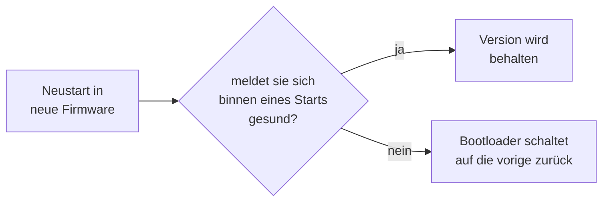

# Updates über WLAN und Notfallrettung

Nach der ersten Installation über USB braucht man kein Kabel mehr. Das Gerät kann seine eigene Firmware über das Netzwerk austauschen. Das nennt man **OTA** — *Over The Air*.

## Warum das sicher ist: zwei Speicherabschnitte

Ein Firmware-Update ist eigentlich ein riskanter Vorgang: man überschreibt genau das Programm, das gerade läuft. Bricht die Übertragung in der Mitte ab, ist das Gerät ein Briefbeschwerer.

Deshalb gibt es hier **zwei Programm-Abschnitte** im Speicher, `ota_0` und `ota_1`, je 4 MB groß. Es läuft immer nur einer davon.


Geschrieben wird immer in den, der gerade **nicht** läuft. Erst wenn die neue Version komplett und geprüft angekommen ist, wird der Merkzettel umgestellt und neu gestartet. Geht beim Übertragen etwas schief, passiert einfach nichts — die alte Version läuft weiter.

Und wenn die neue Version zwar startet, sich aber falsch verhält? Dann gibt es den **Rollback**: zurück auf den anderen Abschnitt, wo die alte Version noch unangetastet liegt.

## Der automatische Rückfall

Es gibt einen Fall, den das Zwei-Abschnitte-Prinzip allein nicht abfängt: die neue Firmware kommt **vollständig und heil** an, startet aber nicht. Dann ist der Merkzettel längst umgestellt, das Gerät bootet immer wieder in die kaputte Version — und weil es dabei nie ins WLAN kommt, ist auch die Notfallseite weg. Übrig bleibt nur das USB-Kabel.

Genau dafür gibt es einen Wachhund im Bootloader. Er funktioniert so:



Frisch geflashte Firmware gilt zunächst als **auf Bewährung**. Sie muss sich aktiv gesundmelden, sonst nimmt der Bootloader sie beim nächsten Start zurück. Stürzt sie vorher ab — oder kommt sie gar nicht so weit — passiert die Rückkehr von selbst, ohne Kabel und ohne Zutun.

Entscheidend ist, **woran** „gesund" festgemacht wird. Die Begründung dahinter: solange das Gerät sich aus der Ferne neu flashen lässt, ist jede schlechte Version reparierbar — und mehr muss der Wachhund nicht garantieren. Strengere Kriterien wären ein Eigentor: würde man etwa eine bestehende WLAN-Verbindung zum Router verlangen, würde ein Router-Neustart eine völlig intakte Firmware zurückrollen.

Konkret meldet sich die Firmware auf einem von drei Wegen gesund:

* **Nach einer Minute Laufzeit, wenn sie erreichbar ist** — also eine IP vom Router hat oder ihr eigenes Notfall-WLAN aufgespannt hat (das kommt nach 20 Sekunden ohne Router von selbst, ein Router-Ausfall rollt also nichts zurück).
* **Sobald ein Update hereinkommt.** Wer ein neues `firmware.bin` schickt, beweist damit, dass das Gerät erreichbar ist — genau das, worauf die Bewährung wartet. Deshalb kann man auch direkt nach einem Update das nächste schicken.
* **Spätestens nach zehn Minuten**, egal was ist. Ein Gerät, das nur seinen Bildschirm hat, ist über USB immer noch zu retten; es beim nächsten Stromausfall zurückzurollen wäre schlimmer.

Früher wurde das Image schon beim Start bestätigt, noch bevor irgendetwas gelaufen war. Eine Firmware, die zwei Sekunden später abstürzte, galt damit als gesund — und startete in einer Endlosschleife neu, ohne dass der Wachhund je eingriff. Die Minute Bewährung fängt genau das ab.

> [!IMPORTANT]
> Diese Funktion sitzt im **Bootloader**, und ein Update über WLAN tauscht nur das Programm aus. Sie wird deshalb erst wirksam, nachdem der Bootloader einmal **per USB** geschrieben wurde. Bis dahin verhält sich das Gerät wie vorher: eine nicht startende Firmware bleibt liegen.

## Die Adressen

| Methode | Adresse | Wirkung |
| --- | --- | --- |
| `GET` | `/ota` | Auskunft: Version, Build-Nummer, welcher Abschnitt läuft, Laufzeit, Grund des letzten Neustarts, freier Speicher, DMA-Speicher (`dma`, `dma_max`, `dma_min`) |
| `POST` | `/ota` | Firmware schreiben, danach automatisch Neustart. Die Datei wird **vor** dem Löschen geprüft: keine Firmware, falscher Chip oder fremdes Projekt → Ablehnung, der andere Abschnitt bleibt unangetastet |
| `POST` | `/ota/fs` | Dateisystem schreiben; wird sofort neu eingehängt, **kein** Neustart nötig |
| `POST` | `/ota/reboot` | Neustart |
| `POST` | `/ota/rollback` | zurück auf die vorige Version |
| `GET` | `/recovery` | Notfallseite im Browser |

## Der normale Ablauf

```bash
IP=192.168.1.42

# 1. Was läuft gerade?
curl -s http://$IP/ota
# {"version":"v1.0.103","build":192,"fs_build":192,"running":"ota_0",
#  "target_slot":"ota_1","idf":"5.5.5","mac":"...","uptime":2844443,
#  "reset":"SW","heap":29542723,"heap_min":29538820}

# 2. Bauen. Zählt die Build-Nummer einmal hoch und erzeugt beide Dateien.
pio run -e guition-p4

# 3. Dateisystem schreiben. Wird sofort eingehängt, kein Neustart nötig.
curl -H 'Expect:' --data-binary @.pio/build/guition-p4/storage.bin http://$IP/ota/fs

# 4. Firmware schreiben. Das Gerät startet danach selbst neu.
curl -H 'Expect:' --data-binary @.pio/build/guition-p4/firmware.bin http://$IP/ota

# 5. Kontrolle nach ~20 s: build und fs_build müssen gleich sein, reset "SW".
curl -s http://$IP/ota
```

`--data-binary @datei` heißt: schicke den Inhalt dieser Datei unverändert im Anfragekörper. Ohne das `@` würde curl den Dateinamen selbst schicken, und ohne `--data-binary` würde es Zeilenumbrüche umschreiben und die Datei damit zerstören. `-H 'Expect:'` unterdrückt curls „100-continue"-Handschlag bei großen Dateien, den der kleine Webserver nicht kennt — ohne den Schalter wartet curl erst eine Sekunde vergeblich.

**Warum zuerst das Dateisystem?** Weil es ohne Neustart wirkt: das Gerät hängt das Dateisystem aus, schreibt die Partition und hängt sie wieder ein. Die Firmware danach startet dann direkt mit dem passenden Dateisystem. (Früher wurde das Dateisystem erst beim nächsten Hochfahren gelesen und `fs_build` zeigte bis dahin den alten Stand.)

Zur Build-Nummer und warum sie überall gleich sein muss: [Bauen und Flashen](Bauen-und-Flashen#warum-die-build-nummer-so-ein-thema-ist).

## Kein Flackern beim Flashen

Ein Detail, das man erst merkt, wenn es fehlt. Während in den Flash-Speicher geschrieben wird, kommt das Panel nicht mehr zuverlässig an seine Bilddaten — man sieht ein deutliches Flackern und Streifen. Sieht nach Defekt aus, ist aber harmlos.

Deshalb passiert vor jedem Schreibvorgang der Reihe nach:

1. Der Bildstrom zum Browser wird angehalten.
2. Die Sperre auf dem Bildschirmspeicher wird geholt und gehalten — die Oberfläche zeichnet nicht mehr.
3. Die Hintergrundbeleuchtung geht aus.

Danach wird alles zurückgenommen — auch dann, wenn das Update fehlgeschlagen ist. Für den Betrachter ist das Display während des Updates einfach dunkel und wird danach wieder hell.

## Die Notfallseite

`http://<ip-des-geräts>/recovery` ist eine eigenständige Seite, die nichts von der übrigen Oberfläche braucht:

* Firmware-Datei auswählen und flashen, mit Fortschrittsbalken
* Dateisystem-Datei auswählen und flashen
* **Rollback** auf die vorige Version (mit Rückfrage)
* **Neustart** (mit Rückfrage)

Nützlich, wenn gerade kein `curl` zur Hand ist — oder wenn jemand ohne Entwicklungsumgebung das Gerät wieder gerade ziehen soll. Ein Link und eine Datei reichen.

## Was schiefgehen kann

**`bad size`** — die Datei ist größer als der Speicherabschnitt. Meist hat man versehentlich die falsche Datei erwischt.

**`not a firmware image`, `firmware for another chip`, `not a deye_display image`** — die ersten Bytes der Datei passen nicht: kein Firmware-Kopf, falscher Chip oder ein fremdes Projekt. Das wird geprüft, *bevor* der Zielabschnitt gelöscht wird — die vorige Version im anderen Abschnitt bleibt also erhalten und der Rollback funktioniert weiterhin. Typischer Auslöser: `storage.bin` im Firmware-Feld der Recovery-Seite. (Früher wurde der Abschnitt zuerst komplett gelöscht und die Datei erst dann geprüft; danach hatte man keinen Rückfall-Abschnitt mehr.)

**`image invalid`** — die Firmware ist beschädigt. Das merkt der Chip an einer Prüfsumme am Ende der Übertragung, *bevor* er umschaltet. Die alte Version läuft weiter.

**Abbruch ohne Meldung** — das gab es früher, wenn dem Gerät die Netzwerkkanäle ausgegangen waren. Dagegen steht `CONFIG_LWIP_TCP_MSL=5000` in den Einstellungen, siehe [Bauen und Flashen](Bauen-und-Flashen#ein-paar-einstellungen-die-erklärung-brauchen).

**Upload bleibt stehen** — schläft das Handy mitten im Hochladen ein oder reißt das WLAN ab, wartet das Gerät dreimal zwölf Sekunden auf weitere Daten und bricht dann ab: Bildschirm wieder an, alte Version läuft weiter, `/ota` erreichbar. Früher wartete es endlos — mit dunklem Panel und totem Webserver, bis jemand den Stecker zog.

**`reset: PANIC` nach einem Update, alte Build-Nummer läuft** — bis September 2026 traf das etwa jeden vierten bis fünften OTA-Versuch. Die Ursache saß im WLAN-Treiber (esp_hosted), der seine SDIO-Empfangspuffer aus dem knappen internen DMA-fähigen Speicher holte; während des Flash-Schreibens war davon zu wenig übrig, und der Treiber quittierte das mit einem Absturz statt einem Fehler. Seit `CONFIG_ESP_HOSTED_MEMPOOL_PREFER_SPIRAM=y` kommen diese Puffer aus dem 32 MB großen PSRAM; `dma_min` in `/ota` liegt seither bei rund 97 kB statt bei 1–9 kB, und in einer Messreihe liefen 10 Firmware- und 3 Dateisystem-Updates hintereinander ohne einen einzigen Abbruch durch. Sollte es je wieder auftreten: zuerst `dma_min` anschauen. Der Rollback fängt den Fall in jedem Fall ab — einfach noch einmal senden.

**Dateisystem-Update mitten drin abgebrochen** — dann ist das Dateisystem unbrauchbar. Halb so wild: die Firmware läuft weiter und meldet beim Start `Filesystem build unavailable` und `fs_build: -1`. Einfach nochmal schreiben. Klappt auch das nicht, hilft der Weg über USB — der stellt das Dateisystem sicher wieder her.

**Neustart mitten im Upload** — `GET /ota` sagt hinterher, warum:

| `reset` | Bedeutung |
| --- | --- |
| `SW` | unser eigener Neustart nach einem erfolgreichen Update — alles in Ordnung |
| `POWERON`, `EXT`, `USB` | Stromzufuhr, Reset-Taste, USB-Anschluss |
| `PANIC` | echter Absturz |
| `TASK_WDT`, `INT_WDT` | eine Aufgabe kam zu lange nicht dran oder blockierte |
| `BROWNOUT` | die Spannungsversorgung ist eingebrochen — Netzteil oder Kabel prüfen |

`heap_min` daneben ist der niedrigste freie Speicherstand seit dem Start. Ein Upload, der an Speichermangel stirbt, ist daran auch später noch zu erkennen, obwohl der aktuelle Wert längst wieder normal ist. Der Tab „System & Update" zeigt beides, Absturzursachen in Rot.

Die **Laufzeit** steht in der Kopfzeile der Seite und ist damit auf jedem Tab zu sehen. Sie läuft mit: die Seite zählt die Sekunden selbst weiter und fragt das Gerät nur alle 30 s, weil der Webserver auf Port 80 nur vier Verbindungen gleichzeitig hat und die sich Zähler-Tab, Spiegel und Brücke teilen. Zwischen zwei Abgleichen ist die Zahl also gerechnet, nicht gemessen — und das gibt sie zu:

| Anzeige | Bedeutung |
| --- | --- |
| `2 T  05:13:44` | normal, mit dem Gerät abgeglichen |
| `… (?)` in Orange | zwei Abgleiche in Folge ohne Antwort — weitergezählt, nicht gemessen |
| Zahl in Rot | die Laufzeit ist **zurückgesprungen**, das Gerät hat also neu gestartet |

Der rote Hinweis ist der eigentliche Nutzen: ein Neustart, den niemand ausgelöst hat, fällt sonst nur auf, wenn man zufällig zweimal hinsieht — genau so ist der Absturz vom 11. September entdeckt worden (siehe [Code-Review](Code-Review-2026-09#nachtrag-13-11-september-der-absturz-vom-morgen-ausgewertet)). Ein Neustart, den man auf dieser Seite selbst angestoßen hat, wird **nicht** rot markiert: eine Warnung für das, was man gerade angeklickt hat, erzieht dazu, Warnungen zu ignorieren.

> [!TIP]
> **Langsamer Upload ist ein Warnzeichen.** Der Chip nimmt normalerweise über 100 kB/s an; ein Update ist also nach wenigen Sekunden durch. Kriecht es stattdessen bei 10 bis 20 kB/s, liegt das erfahrungsgemäß nicht am Gerät, sondern am sendenden Rechner. Ein Fall aus der Praxis: ein Mac, der gleichzeitig über WLAN **und** über eine Dock-Ethernetbuchse im selben Subnetz hing. Die Systemroute nahm das Ethernet, und darüber kamen nur 21 kB/s an, über WLAN dagegen 148 kB/s — Faktor sieben. Prüfen mit `ifconfig | grep "inet 192"`; sind es zwei Adressen im gleichen Netz, hilft `curl --interface <ip>`, um den schnellen Weg zu erzwingen.

## Und die Sicherheit?

> [!CAUTION]
> **Es gibt kein Passwort.** Wer dein Netz erreicht, kann die Firmware des Geräts ersetzen — und damit alles tun, was das Gerät kann, einschließlich Wechselrichter umstellen.
>
> Das ist eine bewusste Entscheidung für ein Gerät im eigenen Heimnetz, und für Bastelbetrieb ist es in Ordnung. Was du **nicht** tun solltest: eine Portweiterleitung im Router einrichten, damit du von unterwegs drankommst. Damit stellst du das Gerät ins offene Internet. Nimm stattdessen den [WireGuard-Tunnel](Zeit-und-VPN#wireguard-tunnel) — der ist genau dafür eingebaut.
