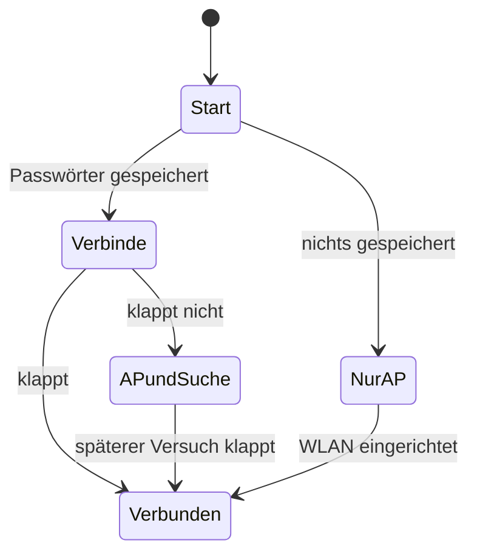

# WLAN und Ersteinrichtung

## Erst mal: WLAN macht ein zweiter Chip

Der Hauptchip ESP32-P4 hat kein eigenes Funkmodul. Auf dem Modul sitzt deshalb noch ein ESP32-C6, der das komplette WLAN übernimmt. Die beiden reden intern miteinander, und zwei Hilfsbibliotheken sorgen dafür, dass sich das im Programm anfühlt wie ein einzelner Chip mit eingebautem WLAN. Näheres unter [Hardware](Hardware#die-sache-mit-dem-zweiten-chip).

## Die zwei Betriebsarten

Ein WLAN-Chip kann zwei Dinge tun:

* sich in ein **bestehendes** WLAN einbuchen — wie dein Handy zu Hause. Das nennt man **Station** (STA).
* selbst ein WLAN **aufspannen**, in das sich andere einbuchen können. Das nennt man **Access Point** (AP).

Dieses Gerät kann beides und entscheidet selbst, was gerade sinnvoll ist:



| Zustand | Was er bedeutet |
| --- | --- |
| `BOOTING` | startet gerade |
| `STA_CONNECTING` | versucht, sich in ein gespeichertes WLAN einzubuchen |
| `STA_CONNECTED` | drin, hat eine IP-Adresse |
| `AP_FALLBACK` | spannt selbst ein WLAN auf, probiert im Hintergrund aber weiter |
| `AP_ONLY` | kein Passwort gespeichert, wartet auf Einrichtung |

Im AP-Betrieb heißt das eigene Netz **`DeyeDisplay-XXXXXX`** — die sechs Zeichen sind die letzten Stellen der Hardware-Adresse, damit zwei Geräte im selben Raum sich nicht in die Quere kommen. Das Standard-Passwort ist **`deyedisplay`** und lässt sich später ändern. Das Gerät selbst ist dann unter `192.168.4.1` erreichbar.

## Ersteinrichtung: der Hotel-WLAN-Trick

Kennst du das Anmeldefenster, das aufspringt, wenn du dich in ein Hotel- oder Café-WLAN einbuchst? Dieses Gerät benutzt genau denselben Mechanismus. Das nennt man **Captive Portal**.

So geht die Einrichtung:

1. Mit Handy oder Notebook dem WLAN `DeyeDisplay-XXXXXX` beitreten (Passwort `deyedisplay`).
2. Es erscheint von selbst die Meldung „Anmeldung beim Netzwerk erforderlich", und die Einrichtungsseite geht auf.
3. Auf der Seite die Netzsuche starten, dein WLAN aussuchen, Passwort eingeben, abschicken.
4. Das Gerät speichert die Zugangsdaten und bucht sich ein. Die IP-Adresse steht danach im Menü unter „WLAN" und im Fenster, das aufgeht, wenn du oben links auf den WLAN-Namen tippst.

### Wie dieser Trick funktioniert

Zwei Dinge greifen zusammen:

**Erstens: alle Namen zeigen auf uns.** Wenn dein Handy `www.beispiel.de` aufrufen will, fragt es zuerst einen Namensdienst (DNS) nach der Adresse. Dieses Gerät betreibt einen eigenen DNS und antwortet auf **jede** Frage mit seiner eigenen Adresse. Egal, welche Seite man aufruft, man landet beim Display.

**Zweitens: wir beantworten die Testanfragen.** Jedes Betriebssystem prüft nach dem Einbuchen automatisch, ob das Internet erreichbar ist. Dazu ruft es eine bestimmte kleine Testadresse auf — Android nimmt `/generate_204`, Apple `/hotspot-detect.html`, Windows etwas Ähnliches. Kommt die erwartete Antwort nicht, sondern eine Umleitung, weiß das System: „hier ist ein Anmeldefenster" — und öffnet es.

Beide Dienste laufen dauerhaft mit und tun nichts, solange sich niemand einbucht.

Ist ein WLAN eingerichtet, zeigt dieselbe Adresse etwas Nützlicheres: den [Web-Mirror](Web-Mirror), also das Display im Browser.

## Einrichtung direkt am Gerät

Das Menü „WLAN" kann dasselbe, nur zum Antippen:

* **Status** — Zustand, verbundenes Netz mit Signalstärke, IP-Adresse, AP-Zustand
* **Gespeicherte Netze** — bis zu **10** Einträge. Jeder hat ein Papierkorb-Symbol zum Löschen; das aktuell verbundene ist grün mit Häkchen markiert.
* **Scan** (oben rechts) — sucht Netze in der Umgebung und listet sie mit Signalstärke. Antippen übernimmt den Namen.
* **Bildschirmtastatur** mit Umlauten und Umschaltung zwischen Groß- und Kleinschreibung.

Das Gerät verbindet sich mit dem gespeicherten Netz, das gerade erreichbar ist. Löscht du das aktive, sucht es sich ein anderes gespeichertes — und wenn keines mehr da ist, spannt es wieder sein eigenes auf.

### Warum gleich zehn Netze?

Weil das Gerät an einem Wechselrichter hängt, und der steht typischerweise im Keller, in der Garage oder im Technikraum — also am Rand der WLAN-Abdeckung. Mit mehreren gespeicherten Netzen (Router, Repeater, Handy-Hotspot für Wartungsarbeiten) bleibt es erreichbar, ohne dass jemand mit einem USB-Kabel in den Keller muss.

## Signalstärke verstehen

Der Wert in dBm ist immer negativ, und **näher an null ist besser**:

| Wert | Bewertung |
| --- | --- |
| −30 bis −60 dBm | sehr gut |
| −60 bis −70 dBm | brauchbar |
| −70 bis −80 dBm | schwach, Verbindungsabbrüche möglich |
| unter −80 dBm | kaum benutzbar |

## Status abfragen

Auf dem Hauptbildschirm oben links steht der Netzname in Grün, wenn eine Verbindung besteht. Antippen öffnet ein Fenster mit IP-Adresse, Signalstärke, Hardware-Adresse und AP-Zustand.

Vom Rechner aus:

```bash
curl -s http://<ip-des-geräts>/api/live   # läuft die Firmware?
curl -s http://<ip-des-geräts>/ota        # Version und Hardware-Adresse
```

## Typische Probleme

**Das Gerät startet immer wieder neu, sobald WLAN dazukommt.** Die Programme auf den beiden Chips passen nicht zueinander. Zum Eingrenzen kann man in `main.c` die Zeile `#define DEYE_ENABLE_WIFI 1` auf `0` setzen: startet das Gerät dann durch, liegt es am Funkchip.

**Das WLAN wird nicht gefunden, obwohl es da ist.** Weit weg vom Router ist nur das 2,4-GHz-Band zuverlässig; 5 GHz kommt durch Wände deutlich schlechter. Ein eigenes 2,4-GHz-Netz hilft mehr als jede Softwareeinstellung.

**Das Anmeldefenster springt nicht auf.** Manche Betriebssysteme merken sich, dass ein Netz kein Portal hat. Dann einfach `http://192.168.4.1` direkt im Browser aufrufen.

**Nach einem Firmware-Update ist das Gerät weg.** Sollte nicht passieren — die Zugangsdaten liegen in einem Speicherbereich, der Updates übersteht. Es sei denn, die Speicheraufteilung selbst wurde geändert. Dann bleibt nur die Einrichtung per USB.
