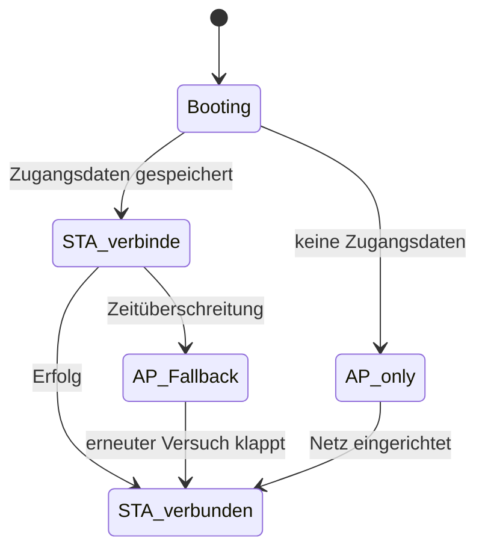

# WLAN und Captive Portal

WLAN läuft nicht auf dem ESP32-P4 selbst, sondern auf dem **ESP32-C6** des Moduls: `esp_hosted` überträgt den Netzwerk-Stack über SDIO, `esp_wifi_remote` leitet die gewohnten `esp_wifi`-Aufrufe dorthin weiter.

## Zustände



| Zustand | Bedeutung |
| --- | --- |
| `BOOTING` | Startphase |
| `STA_CONNECTING` | verbindet mit einem gespeicherten Netz |
| `STA_CONNECTED` | verbunden, IP vorhanden |
| `AP_FALLBACK` | Access Point aktiv, STA versucht es im Hintergrund weiter |
| `AP_ONLY` | keine Zugangsdaten gespeichert |

Im AP-Betrieb heißt das Netz **`DeyeDisplay-XXXXXX`** (die letzten drei Bytes der MAC), Standard-Passwort **`deyedisplay`**. Das Passwort ist in den Einstellungen änderbar, die SSID nicht. Die AP-Adresse ist `192.168.4.1`.

## Erste Einrichtung über das Captive Portal

1. Mit dem Telefon oder Notebook dem Netz `DeyeDisplay-XXXXXX` beitreten.
2. Das Betriebssystem meldet „Anmeldung beim Netzwerk erforderlich" und öffnet die Seite von selbst.
3. Auf der Seite die Netzsuche starten, das eigene WLAN wählen, Passwort eingeben, absenden.
4. Das Gerät speichert die Zugangsdaten und verbindet sich. Die IP steht danach im WLAN-Tab und im Popup hinter dem WLAN-Status oben links.

Technisch dahinter: ein **DNS-Hijack**, der jeden Namen auf die AP-Adresse auflöst, plus ein HTTP-Server, der die Erreichbarkeitsprüfungen der Betriebssysteme (`/generate_204`, `/hotspot-detect.html` und Verwandte) mit einer Umleitung beantwortet — dadurch springt das Anmeldefenster auf. Beide Server laufen dauerhaft und tun nichts, solange kein AP-Client verbunden ist.

Ist ein Netz eingerichtet, liefert die Portal-Seite den [Web-Mirror](Web-Mirror) aus — dieselbe URL, sinnvollerer Inhalt.

## Einrichtung am Gerät

Der Tab „WLAN" bietet dasselbe mit dem gleichen Backend, nur als Touch-Oberfläche:

* **Status** — Zustand, verbundene SSID mit Signalstärke, IP, AP-Zustand
* **Gespeicherte Netze** — bis zu **10** Einträge, jeder mit Papierkorb-Symbol zum Einzel-Löschen; das aktive Netz ist grün mit Häkchen markiert
* **Scan** — Schaltfläche oben rechts, Ergebnisliste mit Signalstärke; Antippen übernimmt die SSID
* **Bildschirmtastatur** mit Umlauten und Umschaltung Groß/Klein

Das Gerät verbindet sich mit demjenigen gespeicherten Netz, das erreichbar ist. Wird das aktive Netz gelöscht, sucht es sich ein anderes gespeichertes — oder fällt in den AP-Betrieb.

## Warum mehrere Netze

Das Gerät hängt an einem Wechselrichter, oft im Keller oder in der Garage, am Rand der Funkabdeckung. Mit mehreren gespeicherten Netzen (Haupt-Router, Repeater, Mobilfunk-Hotspot für Wartungsarbeiten) bleibt es erreichbar, ohne dass jemand mit dem USB-Kabel hingehen muss.

## Status abfragen

Auf dem Hauptbildschirm oben links: SSID in Grün bei Verbindung. Antippen öffnet ein Popup mit IP, Signalstärke, MAC und AP-Zustand.

Über das Netz:

```bash
curl -s http://<ip>/ota      # enthält die MAC-Adresse
curl -s http://<ip>/api/live # bestätigt, dass die Firmware läuft
```

## Fallgruben

* **Bootschleife bei WiFi-Init** — Firmware des C6-Slave passt nicht zum Host. Hier läuft Slave 2.12.8 zu `esp_hosted ~2.12.0`.
* **Nur 2,4 GHz zuverlässig** — bei großer Entfernung zum Router hilft ein separates 2,4-GHz-Netz mehr als jede Softwareeinstellung.
* **Zugangsdaten überleben ein Update**, weil `nvs` seinen Standard-Offset behält. Beim Wechsel des Partitionslayouts wäre das nicht garantiert.
