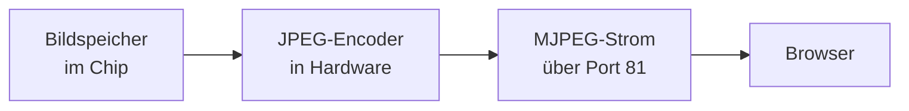

# Web-Mirror und Web-Werkzeuge

Das Gerät ist auch ein kleiner Webserver. Genauer gesagt: **zwei** Webserver.

| Server | Aufgabe |
| --- | --- |
| Port 80 | Seiten, Eingaben, Datenabfragen, Updates, Ersteinrichtung |
| Port 81 | ausschließlich das laufende Bild |

Warum zwei? Weil das Bild eine Dauerverbindung ist, die niemals endet. Läge sie auf demselben Server, würde sie ihn belegen, und alle anderen Anfragen — zum Beispiel deine Fingertipps — müssten warten. Getrennt kommen sie sich nicht in die Weg.

## Das Display im Browser

Rufst du `http://<ip-des-geräts>/` auf, siehst du **das echte Bildschirmbild** — keinen Nachbau der Oberfläche in HTML, sondern genau das, was gerade auf dem Panel steht. Und du kannst hineinklicken, als würdest du das Display berühren.

### Wie das Bild in den Browser kommt



Drei Schritte, jeder mit einem Trick:

**1. Das Bild wird direkt aus dem Bildspeicher gelesen.** Nicht neu gezeichnet — es wird genau der Speicherbereich abgegriffen, der auch das Panel versorgt. Deshalb kostet das praktisch keine Rechenzeit, und deshalb sieht man garantiert genau das, was auf dem Gerät zu sehen ist.

**2. Ein Hardware-Baustein macht daraus ein JPEG.** Der ESP32-P4 hat eine eingebaute JPEG-Einheit. Sie komprimiert das Bild, ohne den Prozessor zu belasten. Das ist der Grund, warum das überhaupt möglich ist — in Software wäre ein Mikrocontroller damit überfordert.

**3. Die Bilder werden als MJPEG gesendet.** MJPEG ist die einfachste Form von Video, die es gibt: eine Folge einzelner JPEG-Bilder, hintereinander durch dieselbe Verbindung geschickt. Braucht keine Videobibliothek und läuft in jedem Browser. Hier: ein Bild alle 120 Millisekunden, also etwa **8 Bilder pro Sekunde**.

Warum nur 8 und nicht 30? Weil der Bildspeicher zwischendurch gesperrt werden muss, damit sich nichts ändert, während man ihn ausliest. Bei zu vielen Bildern pro Sekunde würde man der Oberfläche zu oft in die Arbeit fahren, und die Bedienung am Gerät würde ruckeln. 8 Bilder pro Sekunde sind ein guter Kompromiss.

### Wie die Eingaben zurückkommen

Für die Rückrichtung gibt es einen zweiten, unsichtbaren „Finger": LVGL erlaubt mehrere Eingabegeräte gleichzeitig. Neben dem echten Touchscreen ist ein zweites angemeldet, das seine Ereignisse aus dem Netzwerk bekommt. Für die Oberfläche ist beides gleichwertig — sie kann nicht unterscheiden, ob am Gerät getippt oder im Browser geklickt wurde.

| Anfrage | Wirkung |
| --- | --- |
| `GET /touch?x=&y=&down=` | Klick oder Fingertipp an einer Position |
| `GET /key?...` | Tastendruck ins gerade ausgewählte Textfeld (8 = Rücktaste) |
| `POST /paste` | Text aus der Zwischenablage einfügen |
| `GET /copy` | Inhalt des ausgewählten Feldes auslesen |

Der praktische Nutzen wird schnell klar, wenn man einmal einen WireGuard-Schlüssel eintippen musste: 44 Zeichen aus Groß- und Kleinbuchstaben, Ziffern, Plus und Schrägstrich — auf einer 4,3-Zoll-Bildschirmtastatur. Mit Einfügen aus der Zwischenablage ist das eine Sekunde Arbeit.

> [!NOTE]
> Während eines Firmware-Updates wird der Bildstrom angehalten. Das gibt die Sperre auf dem Bildspeicher frei, das Panel bleibt stehen und flackert nicht. Details unter [OTA und Recovery](OTA-und-Recovery#kein-flackern-beim-flashen).

## Register-Werkzeug `/deye`

Unter `http://<ip-des-geräts>/deye` liegt ein Werkzeug, mit dem man direkt in den Wechselrichter hineinschauen kann. Es benutzt dafür die Zweidrahtleitung — die Anfragen werden zwischen zwei regulären Abfragen eingeschoben, damit sich auf dem Bus nichts überschneidet.

**Register-Probe** — irgendeinen Adressbereich lesen. Angezeigt werden Adresse, Hexwert, der Wert als positive Zahl, der Wert mit Vorzeichen, und bei bekannten Adressen ein Name samt Deutung in Klartext. Gute Startpunkte:

| Adresse / Anzahl | Zeigt |
| --- | --- |
| `142` / `6` | Betriebsart, Energy Mode, Solar Sell |
| `148` / `12` | Zeiten und Leistungen der sechs Zeitfenster |
| `166` / `12` | Ziel-Ladezustände und Netzlade-Freigaben |

**Ein Register schreiben** — für Versuche mit einzelnen Adressen.

> [!TIP]
> Die laufend interessanten Messwerte muss man nicht von Hand suchen: der Tab „Zähler & Deye" zeigt sie unter „Was der Deye daraus macht" fertig aufbereitet — PV, AC-Ausgang, Last, Netz und Batterie, je Phase. Siehe [Deye-Steuerung](Deye-Steuerung#was-der-wechselrichter-selbst-misst).

**Sichern und Zurückschreiben** — ein Adressbereich wird komplett ausgelesen und als CSV-Datei gespeichert, die man in Excel öffnen kann (Spalten `addr;value;hex;signed;name;interp`). Dieselbe Datei lässt sich wieder einspielen; geschrieben wird dabei immer die Spalte `signed`, negative Werte werden korrekt umgerechnet.

> [!CAUTION]
> Vor dem Zurückschreiben **die Zeilen löschen, die nicht geschrieben werden sollen.** Eine Sicherung enthält immer beides — echte Einstellungen und reine Messwerte. Messwertregister sind meist nur lesbar, und ein Schreibversuch führt zu Fehlern oder unerwartetem Verhalten. Und generell gilt: erst wissen, was eine Adresse bedeutet, dann schreiben. Siehe [Deye-Steuerung](Deye-Steuerung).

## Werte als JSON abfragen

Für eigene Dashboards oder Skripte gibt es mehrere Adressen, die einfach nur Daten liefern.

`GET /api/live` — alles, was der Hauptbildschirm zeigt:

```json
{"dev":4,"conn":4,"polls":3377131,"err":68669,
 "pv":6867,"haus":2577,"netz":-685,
 "deye_w":-3547,"deye_soc":91,"byd_w":-58,"byd_soc":80,
 "mqtt_en":1,"mqtt_conn":1,"mqtt_host":"10.0.0.50",
 "ntp":1,"time":"2026-07-26 17:41:37","w":800,"h":480}
```

Zu lesen als: 4 Geräte eingerichtet, 4 verbunden, 3,4 Millionen Abfragen seit dem Start, 6867 W Solarleistung, 2577 W Hausverbrauch, 685 W Einspeisung, Deye lädt mit 3547 W bei 91 % Ladezustand, MQTT verbunden, Uhr gestellt.

`GET /api/devices` — die Werte jedes einzelnen Geräts, siehe [Modbus-TCP](Modbus-TCP#werte-von-außen-abfragen).

`GET /api/meter` — die ganze Zählerkette in einem Poll: was der Eltako je Phase misst, der Sollwertanteil, die Manipulation, was der Deye zu hören bekommt, dazu alle Modbus-TCP-Geräte. `GET /api/meter/manip?en=&m1=&v1=&…[&sp=]` setzt Manipulation und Netz-Sollwert; jeder Parameter ist einzeln setzbar und behält sonst seinen Wert.

`GET /api/deye/live` — was der Wechselrichter über sich selbst meldet, fertig skaliert:

```json
{"valid":1,"online":1,"blocks":15,"age":1507,
 "bat":{"soc":76,"p":1276,"v":53.05,"i":24.48,"t":25.9},
 "pv":{"total":0,"p":[0,0,0,0],"v":[0,0,0,0],"i":[0,0,0,0]},
 "inv":{"total":-1139,"freq":49.95,"p":[-98,-149,-892], …},
 "load":{"total":1144,"ups_total":81, …},
 "grid":{"ct_total":5,"ct":[2,1,2],"inner_total":-1058, …}}
```

`blocks` ist die Bitmaske der Registerblöcke, die in der letzten Runde geantwortet haben (1 = Batterie, 2 = Netz, 4 = Ausgang/Last, 8 = PV). Fällt einer aus, bleiben seine Werte als letzter Stand stehen — die Seite dimmt sie dann. Bedient wird die Anfrage aus dem Poll-Cache, es entsteht also **kein** RS485-Verkehr pro Abfrage: beliebig viele offene Browser kosten den Bus nichts.

`GET /ota` — Version, Build-Nummer, Speicherabschnitt, Laufzeit, Grund des letzten Neustarts, freier Speicher, siehe [OTA und Recovery](OTA-und-Recovery).

Alle setzen den Header `Access-Control-Allow-Origin: *`. Das heißt: man kann sie auch aus einer Webseite heraus abfragen, die auf einem anderen Rechner liegt — der Browser blockiert es nicht.

## Alle Adressen auf einen Blick

| Methode | Adresse | Port |
| --- | --- | --- |
| `GET` | `/` — Display im Browser | 80 |
| `GET` | `/` — Bildstrom | 81 |
| `GET` | `/touch`, `/key`, `/copy` | 80 |
| `POST` | `/paste` | 80 |
| `GET` | `/api/live`, `/api/devices` | 80 |
| `GET` | `/deye`, `/deye/read`, `/deye/write`, `/api/deye/live` | 80 |
| `GET` | `/meter` — Umleitung auf `/deye#meter` | 80 |
| `GET` | `/api/meter`, `/api/meter/manip` | 80 |
| `GET` | `/ota`, `/recovery` | 80 |
| `POST` | `/ota`, `/ota/fs`, `/ota/reboot`, `/ota/rollback` | 80 |
| `GET` | `/scan`, `POST /connect` — WLAN-Einrichtung | 80 |
| `GET` | `/*` — Umleitung im AP-Betrieb | 80 |

> [!CAUTION]
> **Nichts davon ist mit einem Passwort geschützt.** Nicht das Display im Browser, nicht das Register-Werkzeug, nicht das Firmware-Update. Wer dein Netz erreicht, kann den Wechselrichter umstellen und die Firmware ersetzen.
>
> Das ist eine bewusste Entscheidung für ein Gerät im eigenen, vertrauenswürdigen Heimnetz. Was du auf keinen Fall tun solltest: eine Portweiterleitung im Router einrichten, um von außen draufzukommen. Dafür gibt es den [WireGuard-Tunnel](Zeit-und-VPN#wireguard-tunnel).
